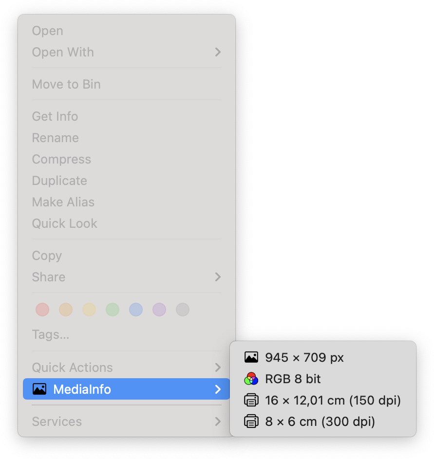
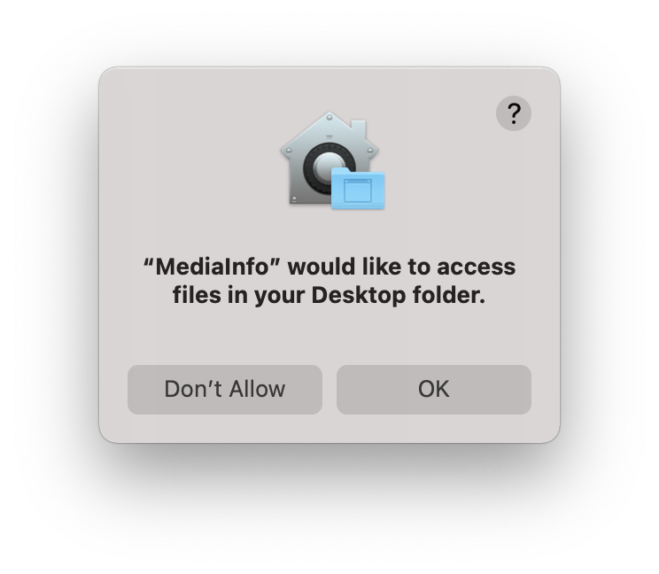
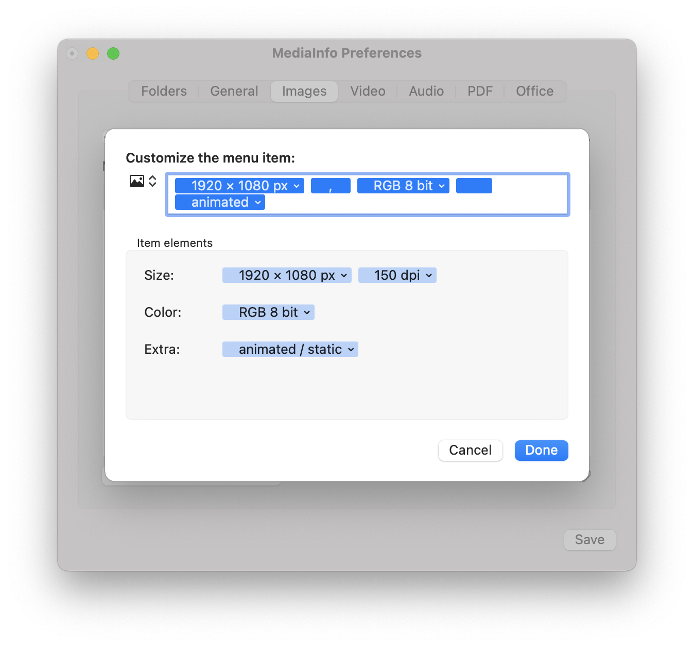
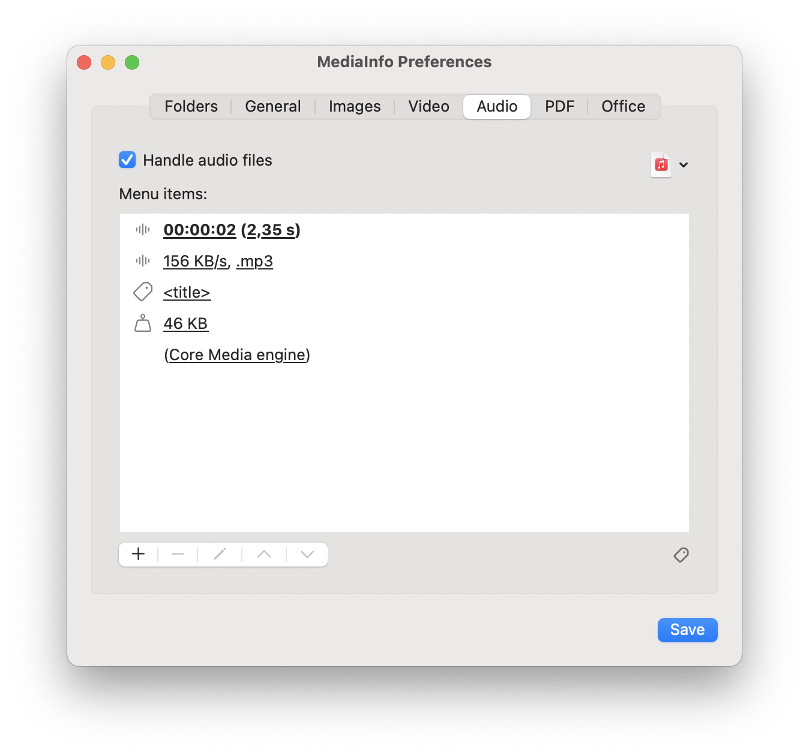
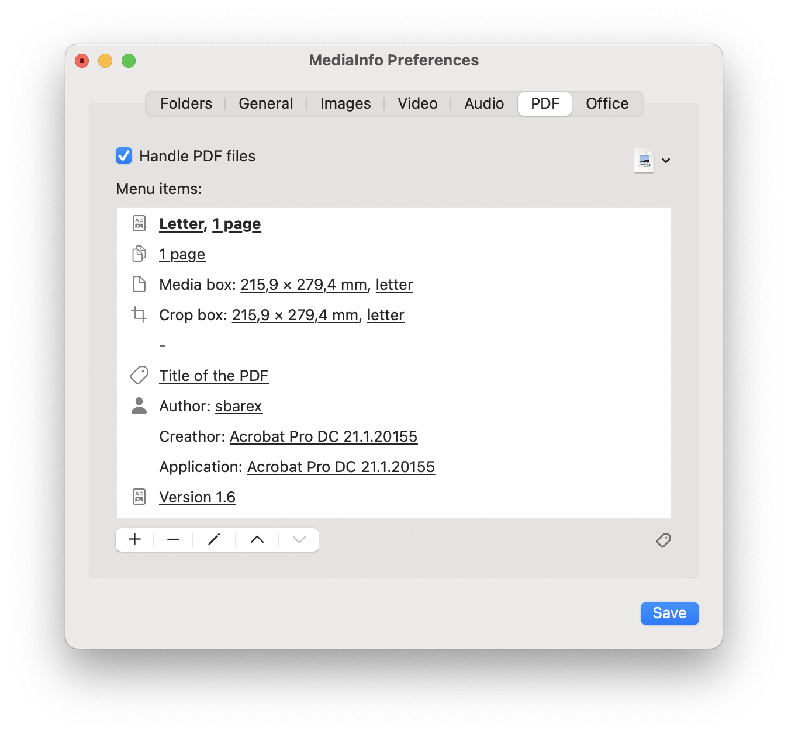

#  MediaInfo - MacOS Finder Sync Extension

Extension to display information about multimedia (images, videos and audio), PDF and Office files in the Finder contextual menu.



> **MediaInfo is distributed in the hope that it will be useful but WITHOUT ANY WARRANTY.**

## Installation

Head over to the [releases](https://github.com/sbarex/MediaInfo/releases) page to view the latest version. 

Move the downloaded app on your Applications folder and launch it to set the monitored folders and the other settings. Then you need to enable the associated Finder Sync Extension on the System Preferences / Extensions.


Now right click (or `control` click) on an image or video within a monitored folder to see the contextual menu with the media information.

| Image menu | Video Menu |
|:---------|:--------- |
|  |  |


> **The precompiled app is not notarized or signed.**

When you download the precompiled app directly you must strip quarantine flag.
The first time you can launch the app with right click (or ctrl click) on the app icon and choosing the open action.

To strip the quarantine flag you can also execute this command from the terminal:

```
$ xattr -r -d com.apple.quarantine "FULL PATH OF THE MediaInfo .app (you can drag the file to get the pull path)"
```

Alternatively, you can open System Preferences > Security & Privacy > General (tab) then clicking the `Open Anyway` button.

This will resolve the error of an unsigned application when launching the app.

**When the monitored folders are changed or when the Finder Sync extension is restarted, the System may display a confirmation warning to allow read access to the files of the monitored folders. _Access must be granted for the Finder extension to work._**



## Settings

With the Application you can customize the monitored folders and the properties to be shown inside the contextual menu.

**Information about media files is shown only for files within the monitored folders (and their subfolders).**


The _General_ tab allow to set some common options:


|**Option**|**Description**|
|:-----------|:-----------------|
|Show menu icons|Show icons inside the contextual menu. You can customize the icon for each menu item. Some icons (image, video, pdf, page, ratio, media box, bleed box, art box, text document) respect the orientation (portrait or landscape) of the source. The _color_ icon respects the color space (RGB, CMYK, gray scale, B/W, Lab).|
|Skip items with no data for the placeholders|Do not insert menu item with all empty placeholders.|
|Show info on a submenu|If enabled, on the contextual menu is added a submenu with the info items, otherwise all items are put on the main contextual menu.|
|Show main info on the submenu title|If enabled, a submenu with file information is added to the context menu, otherwise all items are placed in the main context menu.|
|Use first menu item as Main info|Use the first item as the main title for the submenu.|
|Menu action open the selected file|If checked, each menu item will open the source file with the default application. |
|Allow rounded aspect ratio|For images and videos, allow to round the size for a better ratio. |
|Media engine priority|Allows you to choose the order in which the media engines are used to recognize images, videos and sounds. Not all engines can recognize all file properties. If one engine fails to process a file, the next engine is tried.  |

Media engines:
- _Core Media_: it uses the Apple CoreMedia APIs to parse media files. It is able to recognize many formats and most of their properties.
- _FFMpeg_: it uses the FFMpeg library to analyze multimedia files. It generally supports more files and provides more detailed information. However, it requires more resources. 
- _Metadata_: Use Apple Core Service APIs to extract information from metadata. It requires fewer resources but handle less information.


### Settings the menu items

For each managed format it is possible to customize the list of menu items. For each item you can combine plain text with the placeholder which will be filled with its file property.

When composing the menu label, any worthless placeholders are left blank. Multiple spaces or punctuation marks (comma and semicolon) or empty parentheses are automatically eliminated, for this reason it is suggested to separate placeholders whose value may not always be available with spaces, commas or semicolons.

You can also specify an explanatory icon for each item. Some icons (_image_, _video_, _pdf_, _page_, _ratio_, _media box_, _bleed box_, _art box_) respect the orientation (portrait or landscape) of the source. The _color_ icon respects the color space (RGB, CMYK, gray scale, B/W, Lab).

Use a single dash (`-`) to create a menu separator. Please note that for a macOS limitation the separator item will not be shown with the usual dividing line but with an empty menu item.  



### Images


Available information:
|**placeholder**|**description**|**example**|
|:----|:----|:----|
|size|Size of the image.|_1920 × 1080 px_|
|width|Width of the image.|_1920 px_|
|height|Height of the image.|_1080 px_|
|aspect ratio|Aspect ratio.|_16 : 9_|
|resolution name|Name of the resolution.|_VGA_, _FullHD_, …|
|color space|Color space.|_RGB_, _CMYK_, _GRAYSCALE_, …|
|depth|Number of bits per pixel.|_24 bit_|
|color space & depth|Color space and depth.|_RGB 8 bit_|
|animation|State of the animation.|_animated_ or _static_|
|is animated|Show if the image is animated.|_animated_ or empty|
|dpi|Printer resolution.|_150 dpi_|
|printed size|Printer size. You can choose a custom dpi resolution and different unit (cm, mm, inch).|_21 × 29.7 cm (300 dpi)_|
|paper format|Paper format for the printed size.|_A4_, _Letter_, …|
|file size|File size|_5 Mb_|
|file name|Name of the file|_image.jpg_|
|file extension|Extension of the file|_jpg_|

Supported image formats:
- images handled by the MacOS via CoreGraphics
- `.webp` with `libwebp`
- `.svg` files
- images handled by `ffmpeg`
- `.pbm` formats
- `.bpg` format (parsing the file header).


### Video files


Available information:
|**placeholder**|**description**|**example**| |
|:----|:----|:----|:----:|
|size|Size of the image.|_1920 × 1080 px_||
|width|Width of the image.|_1920 px_||
|height|Width of the image.|_1080 px_||
|aspect ratio|Aspect ratio.|_16 : 9_||
|resolution name|Name of the resolution.|_VGA_, _FullHD_, …||
|duration|Duration.|_01:15:23_, …||
|seconds|Duration in seconds.|_60 s_||
|bit rate|Bit rate.|_1 Mb/s_||
|start time|Start time.|_start at 00:00:00_, …||
|start time (seconds)|Start time in seconds.|_start at second 0_||
|launguage code|Language country code.|_EN_||
|launguage flag|Language country flag.|_:it:_||
|codec|Codec name (full name if available, otherwise short name).|_HEVC H.265_||
|codec short name|Codec short name.|_hevc_||
|codec long name|Codec long name.|_HEVC H.265_||
|chapters|Number of chapters.|_2 chapters_ If this placeholder is the only in the menu item will be added a submenu with the list of the chapters.|\*\*|
|video tracks|Number of video tracks.|_2 video tracks_||
|audio tracks|Number of audio tracks.|_1 audio tracks_||
|subtitles|Number of subititles.|_3 subtitles_||
|languages|Number of languages.|_2 languages_ Show the number of available languages on video and audio tracks.||
|frames|Number of frames.|_1.500 frames_||
|frame rates|Frame rates.|_24 fps_||
|profile|Profile.|_Main_|\*|
|title|Title.|||
|encoder|Encoder.|_libffmpeg_||
|field order|Field order.|_top first_|\*|
|pixel format|Pixel format.|_yuv420p_|\*|
|color space|Color space.|_gbr_|\*|
|file size|File size|_5 Mb_||
|file name|Name of the file|_image.jpg_||
|file extension|Extension of the file|_jpg_||

Not all properties are always available, depending on the type of file and the engine used to decode it.

\* Available only with ffmpeg engine.
\*\* Not Available with metadata engine.

It also shows the data of all the video, audio and subtitle tracks present. This information can be viewed within submenus or in the main menu. The information shown for each track is the same as used for video and audio files. 

Supported video format:
- video handled by the MacOS via CoreMedia
- video supported by `ffmpeg` library.

### Audio files



Available information:
|**placeholder**|**description**|**example**|
|:----|:----|:----|
|duration|Duration.|_01:15:23_, …|
|seconds|Duration in seconds.|_60 s_|
|bit rate|Bit rate.|_1 Mb/s_|
|start time|Start time.|_start at 00:00:00_, …|
|start time (seconds)|Start time in seconds.|_start at second 0_|
|langage code|Language country code.|_EN_|
|langage flag|Language country flag.|_:it:_|
|languages|Number of languages.|_2 languages_ Show the number of available languages on video and audio tracks.|
|codec|Codec name (full name if available, otherwise short name).|_MPEG audio layer 2/3_|
|codec short name|Codec short name.|_mp3_|
|codec long name|Codec long name.|_MPEG audio layer 2/3_|
|channels|Number of channels|_2 channels_|
|channels|Audio mono, stereo or number of channels|_Mono_, _Stereo_, _3 channels_, …|
|chapters|Number of chapters.|_2 chapters_ If this placeholder is the only in the menu item will be added a submenu with the list of the chapters.|
|title|Title.||
|encoder|Encoder.|_libffmpeg_|
|file size|File size|_5 Mb_|
|file name|Name of the file|_image.jpg_|
|file extension|Extension of the file|_jpg_|

Not all properties are always available, depending on the type of file and the engine used to decode it.

Supported audio format:
- audio handled by the MacOS via CoreMedia
- audio supported by `ffmpeg` library.

### PDF documents



Available information:
|**placeholder**|**description**|**example**|
|:----|:----|:----|
|media box|Media box. You can choose different unit (pt, inch, mm, cm).|_595 × 842 pt_, _A4_, …|
|bleed box|Bleed box. You can choose different unit (pt, inch, mm, cm, paper size).|_595 × 842 pt_, _A4_, …|
|crop box|Crop box. You can choose different unit (pt, inch, mm, cm, paper size).|_595 × 842 pt_, _A4_, …|
|art box|Art box. You can choose different unit (pt, inch, mm, cm, paper size).|_595 × 842 pt_, _A4_, …|
|paper format|Paper format for the printed size.|_A4_, _Letter_, …|
|pages|Number of pages.|_15 pages_|
|author|Author.|_sbarex_|
|productor|Productor.||
|creator|Creator.||
|creation date|Creation date.||
|modification date|Modification date.||
|keywords|Keywords.||
|object|Object.||
|title|Title.||
|locked|Locked status.|:lock: or empty|
|encrypted|Encrypted status.|:key: or empty|
|allows copy|Allows copy status.|_yes_ or _no_|
|allows print|Allows print status.|_yes_ or _no_|
|security|Security state. Compose the _locked_, _encrypted_, _copy_ and _print_ tokens.|_:lock: no copy_|
|version|PDF version|_version 1.6_|
|file size|File size|_5 Mb_|
|file name|Name of the file|_image.jpg_|
|file extension|Extension of the file|_jpg_|

### Office files
The following file formats are supported: `.docx`, `.rtfx`, `.pptx`, `.odt`, `.ods`, .`odp` (standard office files based on the `XML` format).

Extracting some metadata requires a deep scan of the main file. This can cause a delay in the display of the context menu of office files. 


Available information:
|**placeholder**|**description**|**example**|**require deep scan**|
|:----|:----|:----|:-----:|
|page size|Page size. _Only for text document files._ You can choose different unit (inch, cm, mm). Can also show the paper format, like _A4_.|_21 × 29.7 cm_, _A4_, …|_Yes_|
|creator|File creator.|_sbarex_||
|creation date|Creation date.|_3 May 2021 11:23_||
|last author|User who made the last save.|_sbarex_||
|modification date|Last save date.|_3 May 2021 11:23_||
|title||||
|subject||||
|description|File description / comments.|||
|keywords|Keywords of the file, shown as a submenu.|||
|number of pages|Number of pages (document files), sheets (spreadsheets) or slides (presentations). For spreadsheets, if this placeholder is used alone, it also shows a submenu with the list of sheet names. |_4 pages_, _3 spreadsheets_, _24 slides_|_Yes_|
|characters|Number of characters, without spaces. _Only for text document files._|_1821 characters_||
|characters (spaces included)|Number of characters, with spaces included. _Only for text document files._|_2300 characters_||
|words|Number of words. _Only for text document files._|_150 words_||
|sheets|List of the sheet names, show as a submenu. _Only for spreadsheet files._||_Yes_|
|application|Application that generated the file.|_MicrosoftOffice/15.0 MicrosoftWord_||
|file size|File size|_5 Mb_||
|file name|Name of the file|_image.jpg_||
|file extension|Extension of the file|_jpg_||

## Build from source

Clone the repository (do not download the source code because break the required git submodule):

```sh
git clone https://github.com/sbarex/MediaInfo.git 
```

then open the Xcode project, change the signing team and build. First time the build process can be slow due to the compilation of `ffmpeg`.

The required `FFMpeg` and `WebP` libraries are linked inside the extension and compiled within Xcode, so no others external dependency are required.


The application uses two XPC process:
- _MediaInfo Settings XPC_: used by the main application to store the settings. This bypass the _AppGroup_ functionality that require a signed app to works.
- _MediaInfo Helper XPC_: used by the Finder Extension to read the settings an analyze the selected file. The XPC process can access to files within mounted disks (external or network disks) that would not be accessible by the MediaInfo Finder Extension.

## Credits

Developed by [sbarex](https://github.com/sbarex) with :heart:.

This application uses these libraries: 
- [FFMpeg](https://www.ffmpeg.org/)
- [Kanna](https://github.com/tid-kijyun/Kanna)
- [WebP](https://developers.google.com/speed/webp/)
- [ZipFoundation](https://github.com/weichsel/ZIPFoundation)
