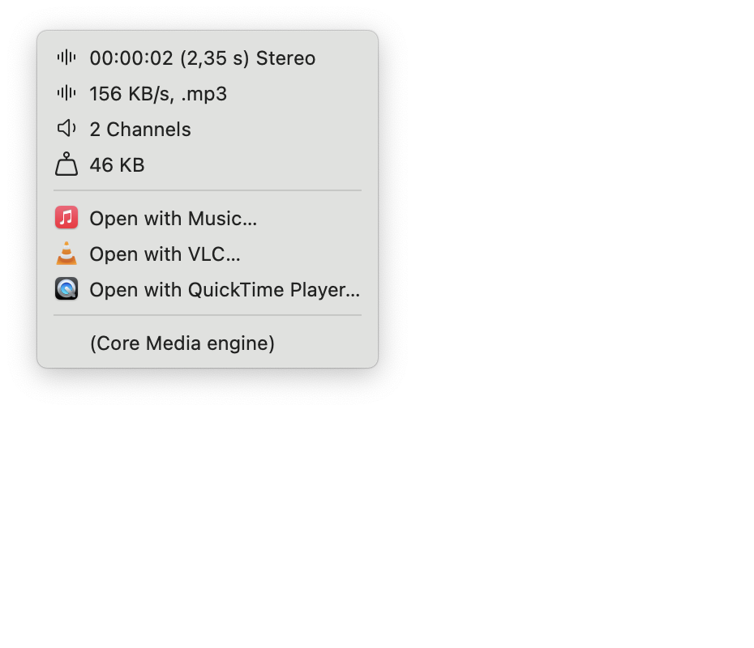
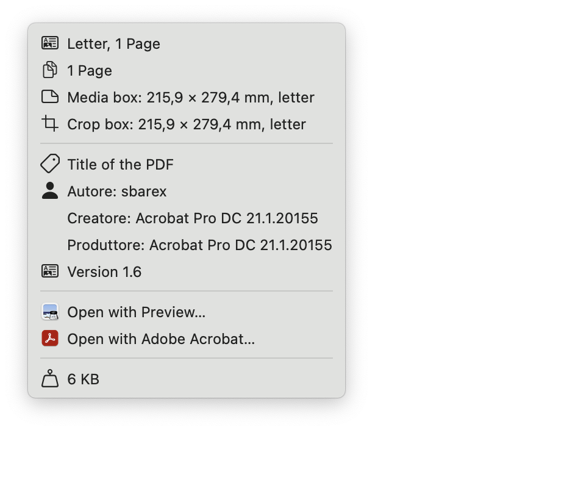
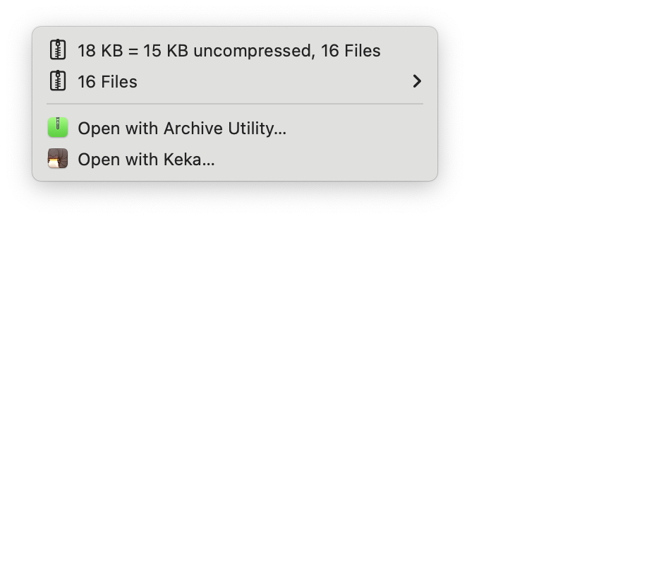
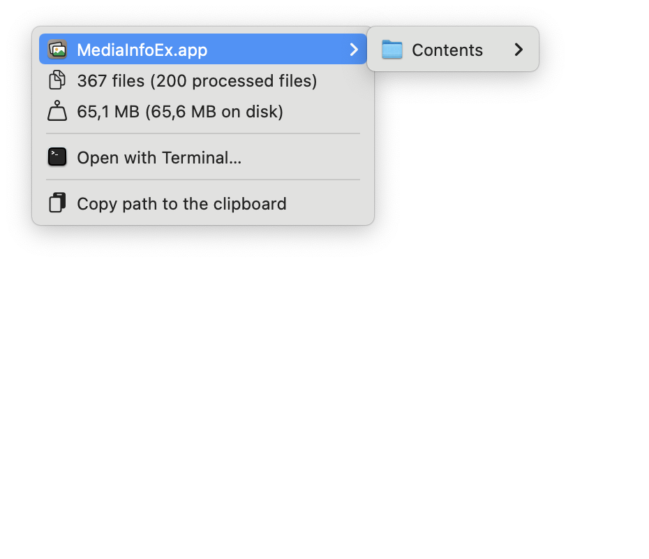
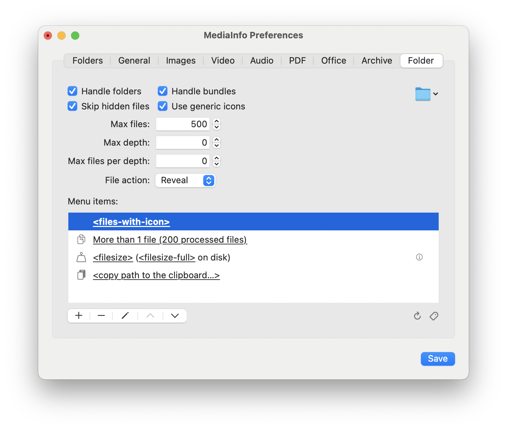
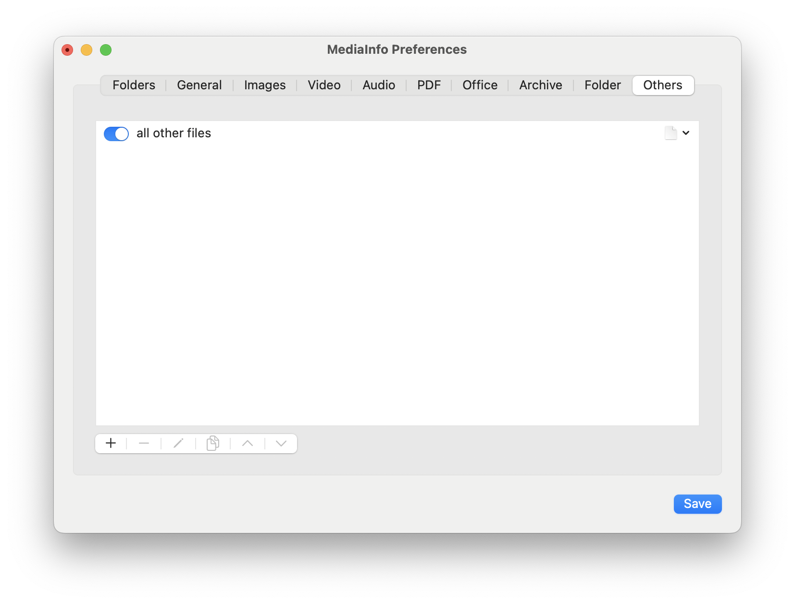
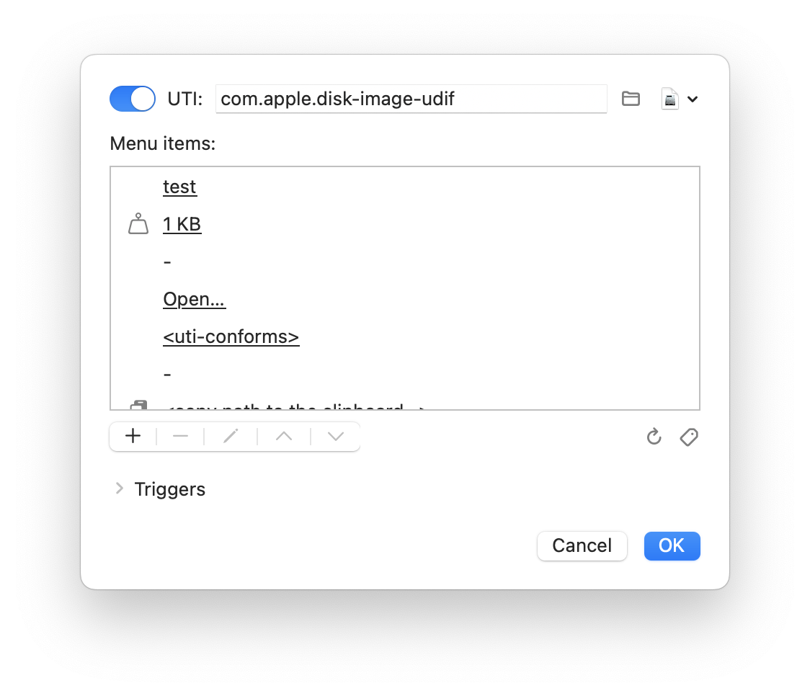

[](https://github.com/sbarex/mediainfo/releases) [](https://github.com/sbarex/mediainfo/releases)

<p align="center">
  
</p>


# MediaInfo - macOS Finder Sync Extension

Extension to display information about multimedia (images, videos and audio), PDF, Office, compressed archives and folders in the Finder contextual menu. Require maxOS 10.15 or higher.


> **MediaInfo is distributed in the hope that it will be useful but WITHOUT ANY WARRANTY.**

  - [Behavior](#behavior)
  - [Installation](#installation)
  - [Settings](#settings)
    - [Monitored folders](#monitored-folders)
    - [General](#general)
    - [Customize the menu items](#customize-the-menu-items)
    - [Common information](#common-information)
    - [Common actions](#common-actions)
    - [Images](#images)
    - [Video files](#video-files)
    - [Audio files](#audio-files)
    - [PDF documents](#pdf-documents)
    - [Office files](#office-files)
    - [Compressed archive files](#compressed-archive-files)
    - [Folders](#folders)
    - [Other files](#other-files)
  - [Menu actions](#menu-actions)
    - [Common actions](#common-actions)
    - [Inline actions](#inline-actions)
    - [Trigger action](#trigger-action)
  - [Scripting support](#scripting-support)
    - [Customize the menu items](#customize–the-menu-items)
      - [Exposed data](#exposed-data)
      - [Inline scripts](#inline-scripts)
      - [Global scripts](#global-scripts)
    - [Triggers](#triggers)
      - [Validate trigger](#validate-trigger)
      - [Before render trigger](#before-render-trigger)
      - [Action trigger](#action-trigger)
    - [Utility functions](#utility-functions)
    - [Action functions](#action-functions)
    - [Common properties](#common-properties)
    - [Properties for images](#properties-for-images)
    - [Properties for video files](#properties-for-video-files)
    - [Properties for audio files](#properties-for-audio-files)
    - [Properties for PDF files](#properties-for-pdf-files)
    - [Properties for Office files](#properties-for-office-files)
    - [Properties for compressed archives](#properties-for-compressed-archives)
    - [Properties for folders](#properties-for-folders)
  - [Known bugs and limitations](#known-bugs-and-limitations)
  - [Build from source](#build-from-source)
    - [Dependencies](#dependencies)
    - [Application processes](#application-processes)
  - [Credits](#credits)
  

# Behavior

This application allows you to customize the context menu for supported files.
When you right-click on a file within a [monitored folder](#monitored-folders) the extension extracts all available information for the file and generates the context menu.

|          |           |
|:---------|:--------- |
| Image menu example  | Video menu example  |
| Audio menu example  | PDF menu example  |
| Office menu example  | Archive menu example  | 
| Folder menu example  | |

With the main application you can [customize the menu](#customize-the-menu-items). You can compose the file properties generating the menu items. It is also possible to use a [script code](#scripting-support) to format the menu items.

Remember that all rendering operations must be completed before the menu can be displayed. MacOS does not allow you to populate on-demand the menu but only before viewing, so any information extraction and formatting operation must be as fast as possible in order not to slow down the opening of the menu. 


# Installation

Go to the [releases](https://github.com/sbarex/MediaInfo/releases) page to download the latest version. 

Move the downloaded app on your Applications folder and launch it to set the monitored folders and the other settings. 

Then you need to enable the associated Finder Sync Extension on the System Preferences / Extensions.


Now right click (or `control` click) on a supported file within a monitored folder to see the contextual menu with the information.

**The precompiled application is not notarized or signed.** The application is compiled as universal binary (Intel and Apple Silicon processor).

**When you manually download the precompiled app directly you must strip quarantine flag.**
The first time you can launch the app with right click (or ctrl click) on the app icon and choose the open action.

Alternatively, you can open System Preferences > Security & Privacy > General (tab) then clicking the `Open Anyway` button.

If the system warns that the application is damaged, use the following terminal command:

```
$ xattr -cr "FULL PATH OF THE MediaInfo .app (you can drag the file to get the pull path)"
```

This will resolve the error of an unsigned/damaged application when launching the app.

> **When the monitored folders are changed or when the Finder Sync extension is restarted, the System may display a confirmation warning to allow read access to the files of the monitored folders. _Access must be granted for the Finder extension to work._**


# Settings

## Monitored folders

With the Application you can customize the monitored folders and the properties to be shown inside the contextual menu.


You can also auto monitor external disk.

> **Information is shown only for files within the monitored folders (and their subfolders).**


## General

The _General_ tab allow to set some common options.


|**Option**|**Description**|
|:-----------|:-----------------|
|Show menu icons|Show icons inside the contextual menu. You can customize the icon for each menu item. Some icons (image, video, pdf, page, ratio, media box, bleed box, art box, text document) respect the orientation (portrait or landscape) of the source. The _color_ icon respects the color space (RGB, CMYK, gray scale, B/W, Lab). The _flag_ icon will be changed to the country language flag when used within a media file.|
|Skip items with no data for the placeholders|Do not insert menu item with all empty placeholders.|
|Show info on a submenu|If enabled, on the contextual menu is added a submenu with the info items, otherwise all items are put on the main contextual menu.|
|Show main info on the submenu title|If enabled, a submenu with file information is added to the context menu, otherwise all items are placed in the main context menu.|
|Use first menu item as Main info|Use the first item as the main title for the submenu.|
|Menu action|Action performed when a menu item is selected. Some menu items always perform a custom action by ignoring this setting. You can use a [custom trigger](#triggers) to handle the menu action.|
|Metadata value on a submenu|In the metadata menu, show the value as a submenu or with the attribute name.|
|Allow rounded aspect ratio|For images and videos, allow to round the size for a better ratio. |
|Format for bytes|Allows you to choose how to display the values in bytes: using the system settings, in decimal format (1KB = 1000 bytes) or binary format (1KB = 1024 bytes)|
|Format for bits|Allows you to choose how to display the values in bits: in decimal format (1Kb = 1000 bits) or binary format (1Kb = 1024 bits)|
|Media engine priority|Allows you to choose the order in which the media engines are used to recognize images, videos and sounds. Not all engines can recognize all file properties. If one engine fails to process a file, the next engine is tried.  |

Media engines:

- _Core Media_: it uses the Apple CoreMedia APIs to parse media files. It is able to recognize many formats and most of their properties.
- _FFMpeg_: it uses the FFMpeg library to analyze multimedia files. It generally supports more files and provides more detailed information. However, it requires more resources. 
- _Metadata_: Use Apple Core Service APIs to extract information from metadata. It requires fewer resources but handle less information.


## Customize the menu items

For each managed format it is possible to customize the list of menu items. For each item you can combine plain text with the placeholder which will be filled with its file property.


When composing the menu title, all worthless placeholders are left blank. Multiple spaces or punctuation marks (comma and semicolon) or empty parentheses are automatically deleted. For this reason, it is suggested to separate placeholders whose value may not always be available with spaces, commas or semicolons.

You can also specify an explanatory icon for each item. Some icons (_image_, _video_, _pdf_, _page_, _ratio_, _media box_, _bleed box_, _art box_) respect the orientation (portrait or landscape) of the source. The _color_ icon respects the color space (RGB, CMYK, gray scale, B/W, LAB).

Use a single dash (`-`) to create a menu separator. Note that for a macOS limitation the separator element will not be shown with the usual dividing line.  

If you need more control over the information displayed by the menu items you can also use custom scripts (see the [Scripting support](#scripting-support) chapter).


## Common information

For each type of file some common information is available:  

|**info**|**placeholder**|**description**|**example**|
|:----|:----|:----|:----|
|file size|`[[file-size]]`|File size.|_5 Mb_|
|allocated file size (with resource fork and metadata)|`[[file-size-full]]`|Total file size including all resource fork and metadata.|_6 Mb_|
|file name|`[[file-name]]`|Name of the file.|_image.jpg_|
|file extension|`[[file-ext]]`|Extension of the file.|_jpg_|
|file creation date|`[[file-cdate]]`|Creation date of the file.|_Yesterday 12:45_|
|file modification date|`[[file-mdate]]`|Modification date of the file.|_Today 11:45_|
|file access time|`[[file-adate]]`|Last access of the file.|_Today 12:35_|
|file modes|``[[file-modes]]``|File modes.|_- rw- r-- r--_|
|file acl|``[[acl]]``|Submenu with the access control list. The submenu title is the formatted file modes.||
|Extended attributes|``[[ext-attributes]]``|Submenu of the extended attributes.||
|file modes & ACL|``[[file-modes:acl]]``|File modes with the ACL submenu.||
|file modes & Extendend attributes|``[[file-modes:ext-attrs]]``|File modes with the Extended attributes submenu.||
|file modes & Extendend attributes|``[[file-modes:acl:ext-attrs]]``|File modes with the ACL and Extended attributes submenus.||
|inline script|`[[script-inline:code]]` where `code` is the javascript source base64 encoded; ``[[script-inline:js:function_name]]`` where `function_name` is the name of a global function (defined somewere) to invoke.|A [script](#scripting-support) that returns a text value to show in the menu title.||
|global script|`[[script-global:code]]` where `code` is the javascript source base64 encoded; ``[[script-global:js:function_name]]`` where `function_name` is the name of a global function (defined somewere) to invoke.|A [script](#scripting-support) that can generate multiple menu items.||
|UTI|``[[uti]]``|Uniform Type Identifier.|_public.jpeg_|
|UTI description|``[[uti-desc]]``|Uniform Type Identifier description.|_JPEG Image_|
|UTI conformances|``[[uti-conforms]]``|Submenu with the Uniform Type Identifier conforms.||
|Spotlight metadata|``[[spotlight]]``|Submenu with the Spotlight metadata||

## Images


Available information:

|**info**|**placeholder**|**description**|**example**|
|:----|:----|:----|:----|
|size|``[[size]]``|Size of the image.|_1920 × 1080 px_|
|width|``[[width]]``|Width of the image.|_1920 px_|
|height|``[[height]]``|Height of the image.|_1080 px_|
|aspect ratio|``[[ratio]]``|Aspect ratio.|_16 : 9_|
|resolution name|``[[resolution]]``|Name of the resolution.|_VGA_, _FullHD_, …|
|number of pixel|``[[pixel-count]]``|Number of pixel.|_786432_|
|number of pixel|``[[mega-pixel]]``|Number of pixel in mega pixel.|_0.79 Mpx_|            
|color space|``[[color]]``|Color space.|_RGB_, _CMYK_, _GRAYSCALE_, …|
|color table|``[[color-table]]``|Color table.|_indexed_, _float_, _float colors_|
|depth|``[[depth]]``|Number of bits per pixel.|_24 bit_|
|color space & depth|``[[color-depth]]``|Color space and depth.|_RGB 8 bit_|
|animation|``[[animated]]``|State of the animation.|_animated_ or _static_|
|is animated|``[[is-animated]]``|Show if the image is animated.|_animated_ or empty|
|with/without alpha channel|``[[alpha]]``|Show if the image has an alpha channel|_transparent_ or _opaque_|
|with alpha channel|``[[is-alpha]]``|Show if the image has an alpha channel|_with alpha channel_ or empty|
|profile name|``[[profile-name]]``|Name of the color profile|_Display LCD_|
|dpi|``[[dpi]]``|Printer resolution.|_150 dpi_|
|printed size|``[[print:dpi:um]]``; ``[[print:um]]`` where um can be `mm`, `cm`, `in`. |Printer size. You can choose a custom dpi resolution and different unit (cm, mm, inch).|_21 × 29.7 cm (300 dpi)_|
|paper format|``[[paper]]``|Paper format for the printed size.|_A4_, _Letter_, …|
|metadata|``[[metadata]]``|Show the metadata in a submenu.||

Supported image formats:

- images handled by the macOS via CoreGraphics
- `.webp` with `libwebp`
- `.svg` files
- images handled by `FFMpeg`
- `.pbm` formats
- `.bpg` format (parsing the file header).

Extracting metadata is a wasteful operation that can slow down the contextual menu display. For this they are only processed if a metadata token is used. 
If you need to access metadata within a script, your code must have this comment at the beginning: `/* require-metadata */`. 


## Video files


Available information:

|**info**|**placeholder**|**description**|**example**| |
|:----|:----|:----|:----|:----:|
|size|``[[size]]``|Size of the video.|_1920 × 1080 px_||
|width|``[[width]]``|Width of the video.|_1920 px_||
|height|``[[height]]``|Height of the video.|_1080 px_||
|aspect ratio|``[[ratio]]``|Aspect ratio.|_16 : 9_||
|resolution name|``[[resolution]]``|Name of the resolution.|_VGA_, _FullHD_, …||
|duration|``[[duration]]``|Duration.|_01:15:23_, …||
|seconds|``[[seconds]]``|Duration in seconds.|_60 s_||
|bit rate|``[[bitrate]]``|Bit rate.|_1 Mb/s_||
|start time|``[[start-time]]``|Start time.|_start at 00:00:00_, …||
|start time (seconds)|``[[start-time-s]]``|Start time in seconds.|_start at second 0_||
|language code|``[[language]]``|Language country code.|_EN_||
|language flag|``[[language-flag]]``|Language country flag.|_:it:_||
|languages|``[[language-count]]``|Number of languages.|_2 languages_ Show the number of available languages on video and audio tracks.||
|codec|``[[codec]]``|Codec name (full name if available, otherwise short name).|_HEVC H.265_||
|codec short name|`[[codec-short]]`|Codec short name.|_hevc_||
|codec long name|`[[codec-long]]`|Codec long name.|_HEVC H.265_||
|video tracks count|``[[video-count]]``|Number of video tracks.|_2 video tracks_||
|video tracks|``[[video]]``|Menu with the video tracks. You can customize the items shows.|||
|audio tracks count|``[[audio-count]]``|Number of audio tracks.|_1 audio tracks_||
|audio tracks|``[[audio]]``|Menu with the audio tracks. You can customize the items shows.|||
|subtitles count|``[[subtitles-count]]``|Number of subtitles.|_3 subtitles_||
|subtitles|``[[subtitles]]``|Menu with the subtitles list.|||
|chapters count|``[[chapters-count]]``|Number of chapters.|_2 chapters_|\*\*|
|chapters|``[[chapters]]``|Menu with the list of the chapters.||\*\*|
|frames|``[[frames]]``|Number of frames.|_1.500 frames_||
|frame rates|``[[fps]]``|Frame rates.|_24 fps_||
|profile|``[[profile]]``|Profile.|_Main_|\*|
|title|``[[title]]``|Title.|||
|encoder|``[[encoder]]``|Encoder.|_libffmpeg_||
|compression|``[[compression]]``|Compression method.|_lossy_, _lossless_|
|field order|``[[field-order]]``|Field order.|_top first_|\*|
|pixel format|``[[pixel-format]]``|Pixel format.|_yuv420p_|\*|
|color space|``[[color-space]]``|Color space.|_gbr_|\*|
|engine|``[[engine]]``||_CoreMedia_|

Not all properties are always available, depending on the type of file and the engine used to decode it.

\* _Available only for files decoded with the FFMpeg engine._
\*\* _Not Available for files decoded with the Metadata engine._

It also shows the data of all the video, audio and subtitle tracks present. This information can be viewed within submenus or in the main menu.  

Supported video format:
- video handled by the macOS via CoreMedia
- video supported by `FFMpeg` library.


## Audio files


Available information:

|**info**|**placeholder**|**description**|**example**|
|:----|:----|:----|:----|
|duration|``[[duration]]``|Duration.|_01:15:23_, …|
|seconds|`[[seconds]]`|Duration in seconds.|_60 s_|
|bit rate|``[[bitrate]]``|Bit rate.|_1 Mb/s_|
|sample rate|``[[sample-rate]]``|Sample rate.|_44.1 kHz_|
|start time|``[[start-time]]``|Start time.|_start at 00:00:00_, …|
|start time (seconds)|``[[start-time-s]]``|Start time in seconds.|_start at second 0_|
|language code|``[[language]]``|Language country code.|_EN_|
|language flag|``[[language-flag]]``|Language country flag.|_:it:_|
|languages|``[[language-count]]``|Number of languages.|_2 languages_ Show the number of available languages on video and audio tracks.|
|codec|``[[codec]]``|Codec name (full name if available, otherwise short name).|_MPEG audio layer 2/3_|
|codec short name|`[[codec-short]]`|Codec short name.|_mp3_|
|codec long name|`[[codec-long]]`|Codec long name.|_MPEG audio layer 2/3_|
|channels|``[[channels]]``|Number of channels.|_2 channels_|
|channels|``[[channels-name]]``|Audio mono, stereo or number of channels.|_Mono_, _Stereo_, _3 channels_, …|
|chapters|``[[chapters]]``|Number of chapters.|_2 chapters_ If this placeholder is the only in the menu item will be added a submenu with the list of the chapters.|
|title|``[[title]]``|Title.||
|encoder|``[[encoder]]``|Encoder.|_libffmpeg_|

Not all properties are always available, depending on the type of file and the engine used to decode it.

Supported audio format:

- audio handled by the macOS via CoreMedia
- audio supported by `FFMpeg` library.


## PDF documents


Available information:

|**info**|**placeholder**|**description**|**example**|
|:----|:----|:----|:----|
|media box|``[[mediabox:um]]`` where `um` can be `pt`, `mm`, `cm`, `inch`, `paper`, `paper:pt`, `paper:mm`, `paper:cm`, `paper:in`.|Media box. You can choose different unit (pt, inch, mm, cm).|_595 × 842 pt_, _A4_, …|
|bleed box|``[[bleedbox:um]]`` where `um` can be `pt`, `mm`, `cm`, `inch`, `paper`, `paper:pt`, `paper:mm`, `paper:cm`, `paper:in`.|Bleed box. You can choose different unit (pt, inch, mm, cm, paper size).|_595 × 842 pt_, _A4_, …|
|crop box|``[[cropbox:um]]`` where `um` can be `pt`, `mm`, `cm`, `inch`, `paper`, `paper:pt`, `paper:mm`, `paper:cm`, `paper:in`.|Crop box. You can choose different unit (pt, inch, mm, cm, paper size).|_595 × 842 pt_, _A4_, …|
|art box|``[[artbox:um]]`` where `um` can be `pt`, `mm`, `cm`, `inch`, `paper`, `paper:pt`, `paper:mm`, `paper:cm`, `paper:in`.|Art box. You can choose different unit (pt, inch, mm, cm, paper size).|_595 × 842 pt_, _A4_, …|
|paper format|``[[mediabox:paper]]``|Paper format for the printed size.|_A4_, _Letter_, …|
|pages|``[[pages]]``|Number of pages.|_15 pages_|
|author|``[[author]]``|Author.|_sbarex_|
|producer|``[[producer]]``|Producer.||
|creator|``[[creator]]``|Creator.||
|creation date|``[[creation-date]]``|Creation date.||
|modification date|``[[modification-date]]``|Modification date.||
|keywords|``[[keywords]]``|Keywords.||
|subject|``[[subject]]``|Subject.||
|title|``[[title]]``|Title.||
|locked|``[[locked]]``|Locked status.|:lock: or empty|
|encrypted|``[[encrypted]]``|Encrypted status.|:key: or empty|
|allows copy|``[[allows-copy]]``|Allows copy status.|_yes_ or _no_|
|allows print|``[[allows-print]]``|Allows print status.|_yes_ or _no_|
|security|``[[security]]``|Security state. Compose the _locked_, _encrypted_, _copy_ and _print_ tokens.|_:lock: no copy_|
|version|``[[version]]``|PDF version.|_version 1.6_|

Adobe Illustrator `.ai` files are also supported.


## Office files

The following file formats are supported: `.docx`, `.rtfx`, `.pptx`, `.odt`, `.ods`, .`odp` (standard office files based on the `XML` format).


Extracting some metadata requires a deep scan of the main file. This can cause a delay in the display of the context menu of office files. For this reason, the deep scan is enabled only when requested by the chosen tokens are present. 
If you need to access metadata within a script, your code must have this comment at the beginning: `/* require-deep-scan */`

Available information:

|**info**|**placeholder**|**description**|**example**|**require deep scan**|
|:----|:----|:----|:----|:-----:|
|page size|``[[size:paper]]``, ``[[size:um]]``, ``[[size:paper:um]]`` where `um` can be `mm`, `cm`, `in`. |Page size. _Only for text document files._ You can choose different unit (inch, cm, mm). Can also show the paper format, like _A4_.|_21 × 29.7 cm_, _A4_, …|_Yes_|
|creator|``[[creator]]``|File creator.|_sbarex_||
|creation date|``[[creation-date]]``|Creation date.|_3 May 2021 11:23_||
|creation user and date|``[[creation]]``|Creation user and date.|_created by sbarex on 3 May 2021 11:23_||
|last author|``[[last-author]]``|User who made the last save.|_sbarex_||
|modification date|``[[modification-date]]``|Last save date.|_3 May 2021 11:23_||
|last author and date|``[[last-modification]]``|User who made the last save and the date.|_last saved by sbarex on Sunday 20 March 2022_||
|title|``[[title]]``||||
|subject|``[[subject]]``||||
|description|``[[description]]``|File description / comments.|||
|keywords|``[[keywords]]``|Keywords of the file, shown as a submenu.|||
|number of pages|``[[pages]]``|Number of pages (document files), sheets (spreadsheets) or slides (presentations). For spreadsheets, if this placeholder is used alone, it also shows a submenu with the list of sheet names. |_4 pages_, _3 spreadsheets_, _24 slides_|_Yes_|
|characters|``[[characters]]``|Number of characters, without spaces. _Only for text document files._|_1821 characters_||
|characters (spaces included)|``[[characters-space]]``|Number of characters, with spaces included. _Only for text document files._|_2300 characters_||
|words|``[[words]]``|Number of words. _Only for text document files._|_150 words_||
|sheets|``[[sheets]]``|List of the sheet names, show as a submenu. _Only for spreadsheet files._||_Yes_|
|presentation format|``[[presentation-format]]``|||
|application|``[[application]]``|Application that generated the file.|_MicrosoftOffice/15.0 MicrosoftWord_||


## Compressed archive files

The compressed archive files are handled by the `libarchive` library. 
The following file formats are supported: `.zip`, `.rar`, `.7z`, `.tar`, `.pax`, .`ar`, `.xar`, `.cab`.


With the `Max files` option, you can set the maximum number of files to process from the compressed archive. Set to zero to disable the limit. Please note that **processing a lot of entries can slow down the menu generation**. Furthermore, **displaying many menu items is a heavy operation**.

The archive file parsing operation is automatically stopped if it takes too long.

Available information:

|**info**|**placeholder**|**description**|**example**|
|:----|:----|:----|:----|
|number of files|``[[n-files]]``|Number of files and directories inside the archive. _It is not affected by the setting of the maximum number of files._|_15 files_|
|number of extracted files|``[[n-files-processed]]``|Number of files and directories processed to be shows in the files menu.|_15 processed files_|
|files summary|``[[n-files-all]]``|Total number of files and number of processed files||
|files menu|``[[files]]``, ``[[files-with-icon]]``|Submenu with the structure of files inside the archive. It is possible to show also the icon of each files. _The items are limited according to the max files and depth options._||
|plain files menu|``[[files-plain]]``, ``[[files-plain-with-icon]]``|Submenu with the list of files inside the archive. It is possible to show also the icon of each files. _The items are limited according to the max files and depth options._||
|uncompressed size|``[[uncompressed-size]]``|Uncompressed size of the archived data. It is not affected by the setting of the maximum number of files .|_8 Mb uncompressed_|
|compression ratio|``[[compression-ratio]]``||_50%_|
|compression summary|``[[compression-summary]]``||_1Mb = 2Mb uncompressed (ratio 50%)_|
|compression format|``[[compression-format]]``||_gzip_|

## Folders

You can handle plain folders and even macOS bundles.



You can limit the processed data with these options:

|**option**|**description**|
|:----|:----|
|Ignore hidden files||
|Use generic icon|Use the standard icon associated to the file type instead of a customized icon.|
|Max files|Overall maximum number of files to process.|
|Max depth|Maximum depth of subfolders. Set to zero for no limit.|
|Max files per depth|Maximum number of files processed within a depth level. Set to zero for no limit.|

Processing the contents of a folder is a resource-intensive operation that can take time. **It is recommended to limit the number of files to be processed.** 

Processing takes place in two steps: 
- calculation of the total number of files and their occupation on disk. All files (including hidden files and those contained in bundles) are counted ignoring the settings on hidden files and bundles. 
- extraction of the list of files according to the limits set in the preferences. 

Each of these operations is aborted, returning a partial result, if it takes too long.

The total number of files and the folder size are acquired only if the specific token is used. 
If you need to access to the allocated size within a script, your code must begin with the comment `/* require-deep-scan */`. If is required to access only to the full size use the comment `/* require-fast-scan */` as the first line.

Available information:

|**info**|**placeholder**|**description**|**example**|
|:----|:----|:----|:----|
|number of files|``[[n-files]]``|Number of files and directories (including hidden files and those contained within bundles). _It is not affected by the setting of the maximum number of files, hidden files and bundle._ Extracting this information can slow down menu generation and stop if it takes too long, returning a partial value.|_150 files_, _More than 1500 files_ (if the operation was interrupted)|
|number of processed files|``[[n-files-processed]]``|Number of files and directories processed to be shows in the files menu.|_15 processed files_|
|files summary|``[[n-files-all]]``|Total number of files and number of processed files||
|folder size|``[[file-size]]``|Size of all files inside the folder. _It is not affected by the setting of the maximum number of files._ The extraction of this info can slow down the menu generation and stop if it takes too long, returning a partial value.|_150 Mb_, _More than 430 Mb_ (if the operation was interrupted)|
|allocated folder size|``[[file-size-full]]``|Size on disk of all files inside the folder (considering also the metadata and resource fork). _It is not affected by the setting of the maximum number of files._ The extraction of this info can slow down the menu generation and stop if it takes too long, returning a partial value.|_155 Mb_, _More than 450 Mb_ (if the operation was interrupted)|
|files menu|``[[files]]``, ``[[files-with-icon]]``, ``[[files-plain]]``, ``[[files-plain-with-icon]]``|Submenu of contained files. The menu can be hierarchical or plain (with indented items). It is possible to show the icon of each files. _The items are limited according to the max files and depth options._||


## Other files

You can also create generic file menus to show basic information. You can use scripts to extract information from the file and place it on the menu. 



It is possible to create menus for specific file formats (identified through the UTI) and also for all files not directly managed. 



If a file conforms to several UTIs defined in the settings, the settings to be used will be chosen according to the order in which they were defined. 


# Menu actions

From the general settings you can set the action to be executed when you choose a menu item:

- do nothing
- open the file with the default application.

You can customize the action in several ways:

- Use a [special menu item](#common-actions) with custom action.
- Generate a menu item with a global script and define a custom function to be executed.
- Define a custom action [trigger](#triggers).

To handle custom action, see the [action functions](#action-functions).


## Common actions

For each file type there are some special menu items with a predefined action: 

|**info**|**placeholder**|**description**|**example**|
|:----|:----|:----|:----|
|open…|``[[open]]``|Menu item for opening the file with the default application.|_Open with Preview…_|
|open with…|``[[open-with:app]]`` where `app` contains the application full path base64 encoded. |Menu item for opening the file with a custom application. |_Open with Adobe Photoshop…_|
|settings…|``[[open-settings]]``|Menu item for open the MediaInfo application to customize settings. |_MediaInfo Settings…_|
|about…|``[[about]]``|Menu item for opening the GitHub page of this project. |_MediaInfo 1.6.1 (19) developed by SBAREX…_|
|copy to the clipboard…|``[[clipboard]]``|Menu item for copying the path to the clipboard. ||
|export info to the clipboard…|``[[export]]``|Menu item for copying the file info (as json) to the clipboard. ||


## Inline actions

Menu items created by a global script can have a custom action. You need to set the `action` attribute to `"custom"` and set `userInfo["code"]` to the name (a string) of an exists function to call to handle the action.
 The function receives as a parameter an object with the info of the selected menu item:
 - `index` (Int): index inside the template
 - `tag`: tag of the associated menu item
 - `menuItem`
    - `image` (String)
    - `template` (String)
 - `action` (String)
 - `userInfo` ([String: Any])


## Trigger action

It is possible to define a trigger action executed when a user chooses a menu item. [See below](#action-trigger) for more info. 


# Scripting support

You can use a javascript code to:

- [Customize the menu items](#customize-the-menu-items):
  - [Output a text](#inline-scripts) inside a menu item.
  - [Generate multiple menu items](#global-scripts), with the possibility to define a custom action to be executed when the user chooses an item.
- Execute a [trigger](#triggers):
  - [Validate the file](#validate-trigger) before processing the file and generate the menu.
  - [Pre-render trigger](#before-render-trigger) to customize the menu item templates. 
  - [Action](#action-trigger) to be executed when the user clicks a menu item.


## Customize the menu items

It is possible to customize the menu items with a javascript code.

The javascript environment is shared with all scripts defined for the menu items, thus allowing you to set values in the code to pass from one script to another. The scripts are executed in order of belonging in the menu. 

Since the environment is shared among all the scripts, **remember to be careful not to declare the same global variables in multiple scripts using `let` and `const` statement** (If you need to redeclare a global variable you can use the `var` statement). 

The javascript environment will be reset every time a new contextual menu generation in required. So, you cannot share data between menu generate for different files.

Exceptions thrown during code execution are indicated by an exclamation icon inside the application. 

It is recommended that you enclose the code within an anonymous function: 

```javascript
(function() {
    let result = '';
    
    // your code here
    
    return result; // <- This will be the menu title.  
})()
```  


There are two script tokes: [inline](#inline-scripts) and [global](#global-scripts). 

The [before render trigger](#before-render-trigger) can be used to customize the templates defined in the settings before the menu generation.


### Exposed data

There are some common global variables.

The `fileData` variable is an object that contains the data representation of the currently processed file. 
The variable `settings` have the current settings. 

These two variables are locked and their properties cannot be changed (in strict mode, if you try to change one of their properties an exception is raised). _Any changes made to the `fileData` or` settings` will not affect the standard token process._


|var|type|description|
|:--|:---|:----------|
|`fileData`|Object|Properties of the processed file.|
|`currentFileType`|Int|Type of the processed file: `1` image, `2` video, `3` audio, `4` office, `5` PDF, `6` archive, `7` 3D model, `8` folder, `9` video track, `10` audio track, `11` others.|
|`settings`|Object|Current settings. |
|`templateItemIndex`|Int|Index (zero-based) of the processing menu item template. Defined only during rendering phase, for the asynchronous function this value is not guaranteed to remain valid.|
|`currentItem`|Object|Reference to the processing menu item ```{index: 0, menuItem: {image: "", template: "[[file-size]]", fileType: 1, action: "default", userInfo: {key1: 1, key2: "value"} }```. Defined only during rendering phase, for the asynchronous function this value is not guaranteed to remain valid.|
|`debugMode`|Bool|`True` if the code is executed inside the main application.| 
|`macOS_version`|String|Current macOS version (like `"12.2.1"`).|

For a descriptions of `fileData` and `settings` properties see the [Common properties](#common-properties).

From the `Window` menu you can enable the JS Console to shows the output of the `console` commands.


### Inline scripts

The inline script token allows you to place the result of the script evaluation inside a menu item with any other tokens. 

The result of the script corresponds to the last statement executed in the code.
The last statement must return a string value (or null).

```javascript
(function() {
    const s1 = "Hello World";

    return s1 + " from " + fileData.fileName; // <- This will be the menu title.
})()
```

### Global scripts

The global token script allows you to create multiple menu items at once.

```javascript
(function() {
    let items = new Array();
    items.push({title: "label 1", image: null});
    items.push({title: "label 2", image: "pencil"});
    items.push("-"); // This is a separator
    items.push({
        title: "submenu",
        items: [
            {title: "first"},
            "second",
        ]
    });

    return items;
})()
```

The last statement executed must return an array representing the menu items to add.

Each element in the returned array can be:

- A string that will be used as the title. You can use `"-"` to add a menu separator.
- An object with these properties:
  - `title` (string, **required**) The title of the menu item. 
  - `image` (string, optional) The image name for the menu item. See below for a list of the available images.
  - `checked` (bool, optional) Set to `true` to add the check mark to the menu item.
  - `indent` (int, optional) Indentation level (from 0 to 15).
  - `tag` (int, optional)
  - `userInfo` ([string: Any]) Dictionary of custom user information.
  - `action` (String) Action to be performed by selecting the menu item. It can be one of these values:
    - `"none"`: do nothing.
    - `"standard"`: execute the action set globally in the settings.
    - `"open"`: open the file with the default application.
    - `"openWith"`: open the file with an application. You need to set the full path of the application in `userInfo["application"]`.
    - `"openSettings"`: open the MediaInfo settings application.
    - `"clipboard"`: copy the path to the clipboard.
    - `"export"`: copy the file info to the clipboard.
    - `"reveal"`: reveal a file on the Finder. You can set `userInfo["file"]` with the path of the file to reveal, otherwise the current file is used.
    - `"about"`: open the GitHub page of this project.
    - `"custom"`: perform a custom action. You need to set the function _name_ to be called in `userInfo["code"]`.
  - `items` (Array, optional) An array of the sub-elements. 
 
For each items inside the menu (standard and created by a global script), is required that the combination of tag and the formatted title **must** be unique. For the standard elements, the assigned tag is the zero index of the template used. 
    
The `image` property can be:

|value|image||
|:----|:----|:---|
|`null` or `"no-image"`||No image, but reserve a space if is set the visibility of icon in the menu items.|
|`no-space`||No image, and do not reserve a space.|
|`target-icon`||Current file icon.|
|`"image"`||_auto oriented_|
|`"image_v"`|||
|`"image_h"`|||
|`"aspectratio"`||_auto oriented_|
|`"aspectratio_h"`|||
|`"aspectratio_v"`|||
|`"color"`||_dynamic_|
|`"color_rgb"`|||
|`"color_cmyk"`|||
|`"color_gray"`|||
|`"color_lab"`|||
|`"color_bw"`|||
|`"print"`, `"printer"`|||
|`"video"`||_auto oriented_|
|`"video_v"`|||
|`"video_h"`|||
|`"audio"`|||
|`"speaker"`, `"speaker_mono"`|||
|`"speaker_stereo"`|||
|`"txt"`|||
|`"abc"`|||
|`"page"`||_auto oriented_|
|`"page_v"`|||
|`"page_h"`|||
|`"pages"`|||
|`"office"`||_auto icon (for word, excel or powerpoint)_|
|`"office"` or `"doc"` or `"docx"`, `"word"`||_auto oriented_|
|`"doc_h"`, `"word_h"`, `"docx_h"`|||
|`"doc_v"`, `"word_v"`, `"docx_v"`|||
|`"xls"`, `"xlsx"`, `"excel"`|||
|`"ppt"`, `"pptx"`, `"powerpoint"`|||
|`"3D"`|||
|`"3d_color"`|||
|`"3d_occlusion"`|||
|`"3d_lines"`|||
|`"3d_normal"`|||
|`"3d_points"`|||
|`"3d_quads"`|||
|`"3d_tangent"`|||
|`"3d_triangle_stripe"`|||
|`"3d_triangle"`|||
|`"3d_uv"`|||
|`"3d_variable"`|||
|`"pdf"`||_auto oriented_|
|`"pdf_h"`|||
|`"pdf_v"`|||
|`"artbox"`||_auto oriented_|
|`"artbox_h"`||
|`"artbox_v"`|||
|`"bleed"`||_auto oriented_|
|`"bleed_h"`|||
|`"bleed_v"`|||
|`"crop"`|||
|`"zip"`|||
|`"script"`|||
|`"gear", "gearshape"`|||
|`"calendar"`|||
|`"clipboard"`|||
|`"flag"`|||
|`"folder"`|||
|`"info"`|||
|`"size"`|||
|`"person"`|||
|`"person_n"`|||
|`"person_y"`|||
|`"people"`|||
|`"group_n"`|||
|`"group_y"`|||
|`"shield"`|||
|`"tag"`|||
|`"pencil"`|||
|`"exclamationmark"`|||

With macOS 11+ you can also use a standard symbol name for the image.


## Triggers

You can set up triggers to run for certain events: 
- trigger executed for validate the file before the info extraction.
- trigger executed before the menu generation, allows to customize the menu item templates 
- trigger executed when a menu item was selected. 


### Validate trigger

You can define a trigger to be executed before processing the file. 
The script must return a Boolean value. `false` prevents the file to be analyzed and no menu will be generated.

```javascript
// currentFile: path of the processing file
return currentFile.indexOf("test") < 0; // Skip files with "test" in the path.

```

> Please note that the javascript context of the validate trigger is not shared with the other code inside the menu items or with the action trigger.


### Before render trigger

This trigger can be used to change the menu items template defined in the settings.
The script must return `null` to not change the settings. Otherwise, must returns an array of menu item templates:

```javascript
return [
    {image: 'image', template: '[[size]]'},
    {image: 'clipboard', template: '[[clipboard]]'},
    {image: '', template: '-'}, // menu separator
    {image: '', template: ''}
];
```

For the `image` property see the [Global scripts](#global-scripts).

The trigger is evaluated inside an anonymous function, so any functions or variables are not propagated to other script.

If you need to export some data set as a property of the `globalThis`:

```javascript
globalThis.myfunc = function() { 
    \\...
};

globalThis.myvar = 4;

return null;

```

There are two ways to generate a menu item template with a script token:
- define the code as a base64 encoded string (with `toBase64()`) and insert it into the token:
```js
let code = "return 'hello world';";
let token = "[[script-inline:"+toBase64(code)+"]]";
```

- define a custom function for the `globalThis` and use its name for the token js attribute:
```js
globalThis.myfunc = function {
    return "hello world";
};

let token = "[[script-inline:js:myfunc]]";

```

### Action trigger

The user can define a custom trigger performed when a menu item is chosen.

The javascript context is the same as all the scripts called to generate the menu items. 

Within the action trigger the var `selectedMenuItem` is set with the properties of the chosen menu item.

To manage the action, see the [action functions](#action-functions).


## Utility functions

These functions are available during the execution of a javascript code.

|func|return type|description|
|:---|:-----|:---|
|`console.log(arg1[, arg2, ...])`|Void|Output a log in the Javascript Console Window (available from the `Window` menu).|
|`console.error(arg1[, arg2, ...])`|Void||
|`console.warn(arg1[, arg2, ...])`|Void||
|`console.info(arg1[, arg2, ...])`|Void||
|`console.debug(arg1[, arg2, ...])`|Void||
|`console.assert(condition, arg1[, arg2, ...])`|Void|Output a log only if the condition is true.|
|`toBase64(string)`|String|Encode the argument to a base64 value \*.|
|`fromBase64(string)`|String|Decode the argument from a base64 value \*.|
|`formatTemplate(template: String)`|{`output`: String, `filled`: Bool}|Format a template. Return an object, on `output` filed the formatted result, the `filled` field indicate if the return has some token filled.|
|`systemExecSync(command, [arguments])`|{`status`: Int, `output`: String}|Execute an external `command` passing the `arguments`. **The command must finish as soon as possible in order not to slow down the display**. The task is automatically stopped if it takes too long. |
 
_\* Some standard tokens (such as scripts and open-width) encode the argument with the base64 standard._


## Action functions

To manage the action when the user clicks on a menu item, these functions are available:

```js
/**
 * Open the file at the specified path with the default application.
 *
 * @param {String} path Full path of the file.
 *
 * @returns {Promise} Returns a Promise.
 *
 * @example 
 * systemOpen(fileData.filePath)
 *    .then(
 *        function() {
 *            console.log("success");
 *        },
 *        function() {
 *            console.error("fail");
 *        },
 *    );
 **/
function systemOpen(path)

/**
 * Open the file path with the specified application.
 *
 * @param {String} path Full path of the file.
 * @param {String} application Full path of the macOS application.
 *
 * @returns {Promise} Returns a Promise.
 *
 * @example
 * systemOpenWith(fileData.filePath, "/Applications/TextEdit.app")
 *    .then(
 *        function() {
 *            console.log("success");
 *        },
 *        function(reason) {
 *            let error = reason; // String or Null
 *            console.error("fail: ", error);
 *        },
 *    );
 **/
function systemOpenWith(path, application)

/**
 * Open the specified application.
 *
 * @param {String} path Full path of the macOS application.
 *
 * @returns {Promise} Returns a Promise.
 *
 * @example
 * systemOpenApp("/Applications/TextEdit.app")
 *    .then(
 *        function() {
 *            console.log("success");
 *        },
 *        function(reason) {
 *            let error = reason; // String or Null
 *            console.error("fail: ", error);
 *        },
 *    );
 **/
function systemOpenApp(path)

/**
 * Execute an external `command` passing the arguments as an array of strings.
 *
 * @param {String} command Full path of the command to be executed.
 * @param {String[]} arguments List of arguments for the command.
 *
 * @returns {Promise} Returns a Promise.
 *
 * @example
 * systemExec("command", ["arg1", "arg2"])
 *    .then(
 *        function (reason) {
 *            let output = reason; // String
 *            console.log("success: ", output);
 *        },
 *        function (reason) {
 *            let exit_code = reason[0]; // Int
 *            let output = reason[1]; // String
 *            console.error("fail: ", exit_code, output);
 *        },
 *    );
 *
 **/
function systemExec(command, arguments)

/**
 * Copy a text into the clipboard.
 *
 * @param {String} text 
 *
 * @returns {Bool} True on success.
 *
 * @example
 * systemCopyToClipboard("Hello world");
 *
 **/
function systemCopyToClipboard(text)
```

> These function are only available inside an action trigger or when executing a custom action from an item generated by a global script.


## Common properties

### Settings

|property|type|description|example|
|:-------|:---|:----|:------|
|`settings`.`folders`|\[String\]|Array of monitored folder path.||
|`settingd`.`bytesFormat`|int|2: system format, 0: decimal, 1: binary||
|`settingd`.`bitsFormat`|int|0: decimal, 2: binary||
|`settings`.`handleExternalDisk`|bool|||
|`settings`.`iconsHidden`|bool|||
|`settings`.`infoOnMainItem`|bool|||
|`settings`.`infoOnSubMenu`|bool|||
|`settings`.`skipEmpty`|bool|||
|`settings`.`tracksGrouped`|bool|||
|`settings`.`useFirstItemAsMain`|bool|||
|`settings`.`version`|double|Version settings.|_2.0_|
|`settings`.`tracksGrouped`|bool|||
|`settings`.`engines`|\[Int\]|Media engine priority. An array of integer. `0`: Core Graphics engine; `1`: FFMpeg engine, `2`: Metadata engine.||
|`settings`.`isRatioPrecise`|bool|||
|`settings`.`menuAction`|int|`0`: do nothing; `1`: open with the default app||
|`settings`.`archiveSettings`|Object|Settings for the compressed archives.||
|`settings`.`archiveSettings`.`enabled`|bool|||
|`settings`.`archiveSettings`.`maxFiles`|int|||
|`settings`.`archiveSettings`.`templates`|Array|Array of menu items templates.||
|`settings`.`archiveSettings`.`triggers`|Object|||
|`settings`.`audioSettings`|Object|Settings for the audio files.||
|`settings`.`audioSettings`.`enabled`|bool|||
|`settings`.`audioSettings`.`templates`|Array|Array of menu items template.||
|`settings`.`audioSettings`.`triggers`|Object|||
|`settings`.`audioTrackSettings`|Object|Settings for the audio tracks||
|`settings`.`audioTrackSettings`.`enabled`|bool|||
|`settings`.`audioTrackSettings`.`templates`|Array|Array of menu item templates.||
|`settings`.`customFormats`|\[Object\]|Settings for other formats.||
|`settings`.`customFormats[0]`.`enabled`|bool|||
|`settings`.`customFormats[0]`.`uti`|String|UTI of the supported files.||
|`settings`.`customFormats[0]`.`templates`|Array|Array of menu items templates.||
|`settings`.`customFormats[0]`.`triggers`|Object|||
|`settings`.`folderSettings`|Object|Settings for the folders.||
|`settings`.`folderSettings`.`enabled`|bool|||
|`settings`.`folderSettings`.`action`|int|`0`: standard action, `1`: open, `2`: reveal.||
|`settings`.`folderSettings`.`bundle`|bool|||
|`settings`.`folderSettings`.`genericIcon`|bool|||
|`settings`.`folderSettings`.`maxDepth`|int|||
|`settings`.`folderSettings`.`maxFiles`|int|||
|`settings`.`folderSettings`.`maxFilesInDepth`|int|||
|`settings`.`folderSettings`.`sizeMethod`|int|`0`: none, `1`: fast, `2`: full.||
|`settings`.`folderSettings`.`skipHidden`|bool|||
|`settings`.`folderSettings`.`templates`|Array|Array of menu items templates.||
|`settings`.`folderSettings`.`triggers`|Object|||
|`settings`.`imageSettings`|Object|Settings for the images.||
|`settings`.`imageSettings`.`enabled`|bool|||
|`settings`.`imageSettings`.`metadata`|bool|||
|`settings`.`imageSettings`.`templates`|Array|Array of menu items templates.||
|`settings`.`imageSettings`.`triggers`|Object|||
|`settings`.`officeSettings`|Object|Settings for the office files.||
|`settings`.`officeSettings`.`enabled`|bool|||
|`settings`.`officeSettings`.`deepScan`|bool|||
|`settings`.`officeSettings`.`templates`|Array|Array of menu items templates.||
|`settings`.`officeSettings`.`triggers`|Object|||
|`settings`.`otherFormats`|Object|Settings for other formats not specified.||
|`settings`.`otherFormats`.`enabled`|bool|||
|`settings`.`otherFormats`.`templates`|Array|Array of menu items templates.||
|`settings`.`otherFormats`.`triggers`|Object|||
|`settings`.`pdfSettings`|Object|Settings for the PDF files.||
|`settings`.`pdfSettings`.`enabled`|bool|||
|`settings`.`pdfSettings`.`templates`|Array|Array of menu items templates.||
|`settings`.`pdfSettings`.`triggers`|Object|||
|`settings`.`videoSettings`|Object|Settings for the video files.||
|`settings`.`videoSettings`.`enabled`|bool|||
|`settings`.`videoSettings`.`groupTracks`|bool|||
|`settings`.`videoSettings`.`templates`|Array|Array of menu items templates.||
|`settings`.`videoSettings`.`triggers`|Object|||
|`settings`.`videoTrackSettings`|Object|Settings for the video tracks.||
|`settings`.`videoTrackSettings`.`enabled`|bool|||
|`settings`.`videoTrackSettings`.`templates`|Array|Array of menu items templates.||


### fileData

|property|type|description|example|
|:-------|:---|:----|:------|
|`fileData`.`fileUrl`|String|The url of the processed file.|_"file:///Users/Default/Documents/file.jpg"_|
|`fileData`.`fileSize`|int|File size (in bytes) of file.|_31470_|
|`fileData`.`fileName`|String|File base name.|_"file.jpg"_|
|`fileData`.`fileExtension`|string|File extension.|_"jpg"_|
|`fileData`.`filePath`|String|Full path.|_"/Users/Default/Documents/file.jpg"_|
|`fileData`.`fileCreationDate`|Int|Creation date (Unix timestamp).||
|`fileData`.`fileModificationDate`|Int|Modification date (Unix timestamp).||
|`fileData`.`fileAccessDate`|Int|Last access date (Unix timestamp).||
|`fileData`.`fileMode`|Int|Unix file modes.||
|`fileData`.`fileFormattedMode`|String|Unix file modes.|_"- rw- r-- r--"_|
|`fileData`.`spotlight`|\[String: Any\]|List of the spotlight metadata. For the key see https://developer.apple.com/documentation/coreservices/file_metadata/mditem .||
|`fileData`.`acl`|\[Object\]|Access Control List.||
|`fileData`.`acl[0]`.`name`|String|User/Group name.|_sbarex_|
|`fileData`.`acl[0]`.`id`|Int|User/Group id.|_501_|
|`fileData`.`acl[0]`.`uid`|String|Unique User/Group id.|_2F609312-13E2-4765-BC22-07C3F42A109B_|
|`fileData`.`acl[0]`.`isUser`|Bool|||
|`fileData`.`acl[0]`.`allow`|Bool|||
|`fileData`.`acl[0]`.`attributes`|[String]||_`["read","write","readattr","readsecurity"]`_|
|`fileData`.`uti`|String|Uniform Type Identifier.|_"public.jpeg"_|
|`fileData`.`utiConforms`|[String]|Uniform Type Identifier conformance.|_["public.image", "public.item", "public.data", "public.content"]_|
|`fileData`.`extAttrs`|[String: String]|Extended attributes.||
|`fileData`.`extra`|[String: Any]|Extra info.||


## Properties for images

|property|type|description|example|
|:-------|:---|:----|:------|
|`fileData`.`depth`|int||_8_|
|`fileData`.`dpi`|int||_300_|
|`fileData`.`hasAlpha`|bool||_false_|
|`fileData`.`isAnimated`|bool||_false_|
|`fileData`.`isFloating`|bool||_false_|
|`fileData`.`isIndexed`|bool||_false_|
|`fileData`.`colorMode`|string||_"RGB"_|
|`fileData`.`profileName`|string||_"Color LCD"_|
|`fileData`.`metadata`|Object|All extracted metadata.||
|`fileData`.`metadata`.`Exif`|Array|Exif metadata.||
|`fileData`.`metadata`.`ExifAux`|Array|Auxiliary Exif metadata.||
|`fileData`.`metadata`.`TIFF`|Array|TIFF metadata.||
|`fileData`.`metadata`.`JFIF`|Array|JFIF metadata.||
|`fileData`.`metadata`.`GIF`|Array|GIF metadata.||
|`fileData`.`metadata`.`HEICS`|Array|HEICS metadata.||
|`fileData`.`metadata`.`PNG`|Array|PNG metadata.||
|`fileData`.`metadata`.`IPTC`|Array|IPTC metadata.||
|`fileData`.`metadata`.`GPS`|Array|GPS metadata.||
|`fileData`.`metadata`.`RAW`|Array|RAW metadata.||
|`fileData`.`metadata`.`Canon`|Array|Canon metadata.||
|`fileData`.`metadata`.`Nicon`|Array|Nicon metadata.||
|`fileData`.`metadata`.`Minolta`|Array|Minolta metadata.||
|`fileData`.`metadata`.`Fuji`|Array|Fuji metadata.||
|`fileData`.`metadata`.`Olympus`|Array|Olympus metadata.||
|`fileData`.`metadata`.`Pentax`|Array|Pentax metadata.||
|`fileData`.`metadata`.`8BIM`|Array|8BIM metadata.||
|`fileData`.`metadata`.`DNG`|Array|DNG metadata.||
|`fileData`.`metadata`.`OpenEXR`|Array|OpenEXR metadata.||
|`fileData`.`metadata`.`Apple`|Array|Apple metadata.||
|`fileData`.`metadata`.`File`|Array|File metadata.||
|`fileData`.`metadata`.`WebP`|Array|WebP metadata.||
|`fileData`.`metadata`.`TGA`|Array|TGA metadata.||
|`fileData`.`metadataRaw`|Object|An object with the same properties of `fileData`.`metadata` with a JSON representation of the original metadata array. _Only dictionaries that can be converted to JSON are exported._ ||

If a script require the metadata, add at the begin of the code the comment `/* require-metadata */`.
Depending on the image type, not all metadata properties will be populated. 

Every metadata group is an array of objects. Each object has three string properties: `code`, `value` and `label`. For a list of metadata codes see ImageIO - `CGImageProperties.h` on the Apple documentation.


## Properties for video files

|property|type|description|example|
|:-------|:---|:----|:------|
|`fileData`.`audioTracks`|Array|||
|`fileData`.`bitRate`|int||_1048576_|
|`fileData`.`chapters`|Array|||
|`fileData`.`codecLongName`|string\|null||_"H265 / HEVC"_|
|`fileData`.`codecShortName`|string||_"hevc"_|
|`fileData`.`colorSpace`|int\|null||_7_|
|`fileData`.`colorSpaceLabel`|string\|null||_"smpte240m"_|
|`fileData`.`duration`|int|Number of seconds.|_3600_|
|`fileData`.`encoder`|string\|null|||
|`fileData`.`engine`|int|Engine used to decode the file.|_1_|
|`fileData`.`engineName`|String|Engine used to decode the file.|_"Core Media engine"_|
|`fileData`.`fieldOrder`|int\|null|`0`: topFirst. `1`: bottomFirst. `2`: topFirstSwapped. `3`: bottomFirstSwapped. `4`: unknown. `5`: progressive.|_0_|
|`fileData`.`fieldOrderLabel`|string\|null||_"top first"_|
|`fileData`.`fps`|int||_24_|
|`fileData`.`frames`|int|||
|`fileData`.`isLossless`|bool\|null|||
|`fileData`.`lang`|string\|null||_EN_|
|`fileData`.`langFlag`|string\|null||_":it:"_|
|`fileData`.`pixelFormat`|int\|null||_32_|
|`fileData`.`pixelFormatLabel`|int\|null||_32_|
|`fileData`.`profile`|string\|null||_"Main"_|
|`fileData`.`startTime`|int||_-1_|
|`fileData`.`subtitles`|Array|||
|`fileData`.`title`|string\|null||_"Movie title"_|
|`fileData`.`videoTrack`|Array|Main video track.||
|`fileData`.`videoTracks`|Array|||

Every item in the `fileData`.`audioTracks` is an object with these properties:

|property|type|description|example|
|:---|:---|:----|:------|
|`codecLongName`|string\|null||_"MP3 (MPEG audio layer 3)"_|
|`codecShortName`|string||_"mp3"_|
|`bitRate`|int||_524800_|
|`channels`|int||_2_|
|`duration`|int|Number of seconds.|_3600_|
|`encoder`|string\|null|||
|`isLossless`|bool\|null||_false_|
|`lang`|string\|null||_EN_|
|`langFlag`|string\|null||_":it:"_|
|`startTime`|int||_0_|
|`title`|string|||

Every item in the `fileData`.`chapters` is an object with these properties:

|property|type|description|example|
|:-------|:---|:----|:------|
|`title`|string\|null|||
|`start`|int||_201_|
|`end`|int||_600_|

Every item in the `fileData`.`subtitles` is an object with these properties:

|property|type|description|example|
|:-------|:---|:----|:------|
|`title`|string\|null|||
|`lang`|string\|null||_"EN"_|
|`langFlag`|string\|null||_":it:"_|


## Properties for audio files

|property|type|description|example|
|:-------|:---|:----|:------|
|`fileData`.`audioTrack`|Array|Main audio track.||
|`fileData`.`bitRate`|int||_156027_|
|`fileData`.`channels`|int||_2_|
|`fileData`.`chapters`|Array|See the chapters of the video files.||
|`fileData`.`codecLongName`|string\|null|||
|`fileData`.`codecShortName`|string||_"mp3"_|
|`fileData`.`duration`|double||_2.35_|
|`fileData`.`encoder`|string\|null|||
|`fileData`.`engine`|int||_1_|
|`fileData`.`engineName`|String|Engine used to decode the file.|_"Core Media engine"_|
|`fileData`.`isLossless`|bool\|null||_false_|
|`fileData`.`lang`|string\|null||_"EN"_|
|`fileData`.`langFlag`|string\|null||_":it:"_|
|`fileData`.`startTime`|int||_-1_|
|`fileData`.`title`|string\|null|||


## Properties for PDF files

|property|type|description|example|
|:-------|:---|:----|:------|
|`fileData`.`allowsCopying`|bool||_true_|
|`fileData`.`allowsPrinting`|bool||_true_|
|`fileData`.`artBox`|Rect Array|An array of two array. The first contains the x and y coordinate of the origin, ant the second the width and height.|_[[0, 0], [612, 792]_|
|`fileData`.`author`|string||_"sbarex"_|
|`fileData`.`bleedBox`|Rect Array|See `fileData`.`artBox`.||
|`fileData`.`creationDate`|Date\|null|||
|`fileData`.`creationDateTimestamp`|double\|null|Time interval since 1970.|_642924149_|
|`fileData`.`creator`\|null|string||_"Acrobat Pro DC 21.1.20155"_|
|`fileData`.`cropBox`|Rect Array|See `fileData`.`artBox`.||
|`fileData`.`isEncrypted`|bool||_false_|
|`fileData`.`isLocked`|||_false_|
|`fileData`.`keywords`|Array|Array of string.|_["key1", "key2"]_|
|`fileData`.`mediaBox`|Rect Array|See `fileData`.`mediaBox`.||
|`fileData`.`modificationDate`|Date\|null|||
|`fileData`.`modificationDateTimestamp`|double\|null|Time interval since 1970.|_642924257_|
|`fileData`.`pagesCount`|int||_1_|
|`fileData`.`producer`|string\|null||_"Acrobat Pro DC 21.1.20155"_|
|`fileData`.`subject`|string\|null||_"PDF test file"_|
|`fileData`.`title`|string\|null||_"Title of the PDF"_|
|`fileData`.`trimBox`|Rect Array|See `fileData`.`artBox`.||
|`fileData`.`version`|string||_"1.6"_|


## Properties for Office files

|property|type|description|example|
|:-------|:---|:----|:------|
|`fileData`.`application`|string||_"Microsoft Word"_|
|`fileData`.`charactersCount`|int||_1765_|
|`fileData`.`charactersWithSpacesCount`|int||_2000_|
|`fileData`.`creationDate`|Date\|null|||
|`fileData`.`creationDateTimestamp`|double\|null||_666192249.77143204_|
|`fileData`.`creator`|string||_sbarex_|
|`fileData`.`description`|string|||
|`fileData`.`height`|double|Inch.|_11.69291338582677_|
|`fileData`.`keywords`|Array|Array of string.|_["key1", "key2"]_|
|`fileData`.`modificationDate`|Date\|null|||
|`fileData`.`modificationDateTimestamp`|double\|null||_666195849.771433_|
|`fileData`.`modified`|string||_"sbarex"_|
|`fileData`.`pagesCount`|int||_3_|
|`fileData`.`subject`|string|||
|`fileData`.`title`|string|||
|`fileData`.`width`|double|Inch.|_8.2677165354330704_|
|`fileData`.`wordsCount`|int||_123_|
|`fileData`.`sheets`|Array|Array of the sheet names.|_["Worksheet 1", "Worksheet 2"]_|
|`fileData`.`slidesCount`|Int|Number of slides.|_15_|
|`fileData`.`presentationFormat`|String|||


## Properties for compressed archives

|property|type|description|example|
|:-------|:---|:----|:------|
|`fileData`.files|Array|Array of files. The list is limited according to the user settings.||
|`fileData`.unlimitedFileCount|int|Total files inside the archive.|_44_|
|`fileData`.unlimitedFileSize|int|Uncompressed size of all files, in bytes.|_1153761_|

Every item in the `fileData`.`files` array has these properties:

|property|type|description|example|
|:-------|:---|:----|:------|
|`url`|String|URL of the uncompressed file.||
|`path`|String|Full path of the uncompressed file.||
|`originalPath`|string|Full path as saved in the archive.|_"folder/file.ext"_|
|`isAbsolute`|bool|Check if the file has an absolute path.|_false_|
|`type`|int||_5_|
|`typeLabel`|string||_"directory"_|
|`files`|Array|If the item is a directory, this property has the file list.||
|`format`|string||"ZIP 1.0 (uncompressed)"|
|`isEncrypted`|bool||_false_|
|`size`|int|File size, in bytes. Zero for directories.||
|`isApplication`|bool|Check if the file is a macOS Application bundle.|_false_|
|`isDirectory`|bool|Check if the file is a directory.|_false_|
|`isPackage`|bool|Check if the file is a macOS generic bundle.|_false_|
|`isHidden`|bool|Check if the file is hidden (file name start with a dot).|_false_|
|`isAlias`|bool||_false_|
|`isPartial`|bool|`true` if the `files` and/or `size` attributes are incomplete.||


## Properties for folders

|property|type|description|example|
|:-------|:---|:----|:------|
|`fileData`.`folder`|Object|||
|`fileData`.`folder`.`isAlias`|Bool|||
|`fileData`.`folder`.`isApplication`|Bool|||
|`fileData`.`folder`.`isDirectory`|Bool|||
|`fileData`.`folder`.`isHidden`|Bool|||
|`fileData`.`folder`.`isPackage`|Bool|||
|`fileData`.`folder`.`isPartial`|Bool|`true` if the file list of subfiles is incomplete.||
|`fileData`.`folder`.`localizedName`|String?|||
|`fileData`.`folder`.`path`|String||_"/Users/sbarex/Documents/test.jpg"_|
|`fileData`.`folder`.`size`|Int?|||
|`fileData`.`folder`.`url`|String||_"file:///Users/sbarex/Documents/test.jpg"_|
|`fileData`.`folder`.`files`|Array|Array of files with the same properties.||
|`fileData`.`totalPartial`|Bool|`true` if the number of files or the total file size are incomplete.||
|`fileData`.`unlimitedFileCount`|int|Total number of subfiles and folders.||
|`fileData`.`unlimitedFileSize`|int|Total folder size.||
|`fileData`.`unlimitedFullFileSize`|int|Total allocated folder size.||
|`fileData`.`unlimitedFileCount`|int|Total number of subfiles and folders.||
|`fileData`.`unlimitedFileCount`|int|Total number of subfiles and folders.|||`fileData`.`unlimitedFileCount`|int|Total number of subfiles and folders.||


# Known bugs and limitations

- A managed folder placed in the Finder sidebar uses a wrong icon. 
This only happens for directly managed folders, not for subfolders. This is a common issue for many Finder Extension due to a macOS API limitation. **A temporary workaround is to manage the parent folder of the one located in the sidebar.**

- Menu item separators are not rendered as usual.
This is a limitation of the Apple API. 

- The Apple API allow to set only few option for each menu items: `title`, `tag`, `image` (automatically resized to 16x16 px), `indentationLevel`, `enabled`, `state`, `action` (the target is always the `FIFinderSync` instance). When the menu image is passed from the code to the System it will be reprocessed ad lose the template attribute. This prevent the B/W image to change the color from black to white when the menu item is selected.

- When multiple Finder Extensions are enabled, there is no way to set in witch order the menu of every extension is positioned.

- All menu items generated by Finder extensions are available only when all extensions complete their processing stage.

- Files/Folder inside CloudStorage (GoogleDrive, Dropbox, …) cannot be handled.


# Build from source

Clone the repository (do not download the source code because break the required git submodule):

```sh
git clone https://github.com/sbarex/MediaInfo.git 
```

Then open the Xcode project, change the signing team and build. First time the build process can be slow due to the compilation of the dependencies libraries.

The required libraries are linked inside the extension and compiled within Xcode, so no others external dependencies are required.


### Dependencies

This app uses these libraries:
- [`FFMpeg`](https://www.ffmpeg.org/)
- [`WebP`](https://developers.google.com/speed/webp/)
    - [`libpng`](http://www.libpng.org/)
    - [`jpeg-turbo`](https://libjpeg-turbo.org/) (require CMake to build)
- [`libarchive`](https://www.libarchive.org/)
    - [`liblz4`](https://lz4.github.io/lz4/)
    - [`libb2`](https://github.com/BLAKE2/libb2)
    - [`zstd`](https://github.com/facebook/zstd)
    - [`xz`](https://git.tukaani.org/xz.git)
- [`LineNumberTextView`](https://github.com/raphaelhanneken/line-number-text-view)
    
## Application processes

The application uses two XPC processes:
- _MediaInfo Settings XPC_: used by the main application to store the settings. This bypass the _AppGroup_ functionality that require a signed app to works.
- _MediaInfo Helper XPC_: used by the Finder Extension to read the settings an analyze the selected file. The XPC process can access to files within mounted disks (external or network disks) that would not be accessible by the MediaInfo Finder Extension.


# Credits

Developed by [sbarex](https://github.com/sbarex) with :heart:.
