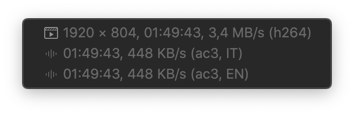
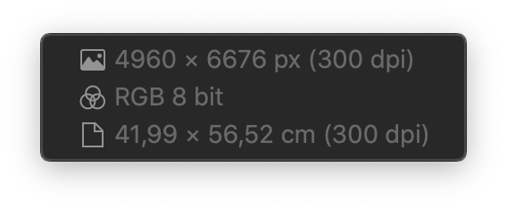
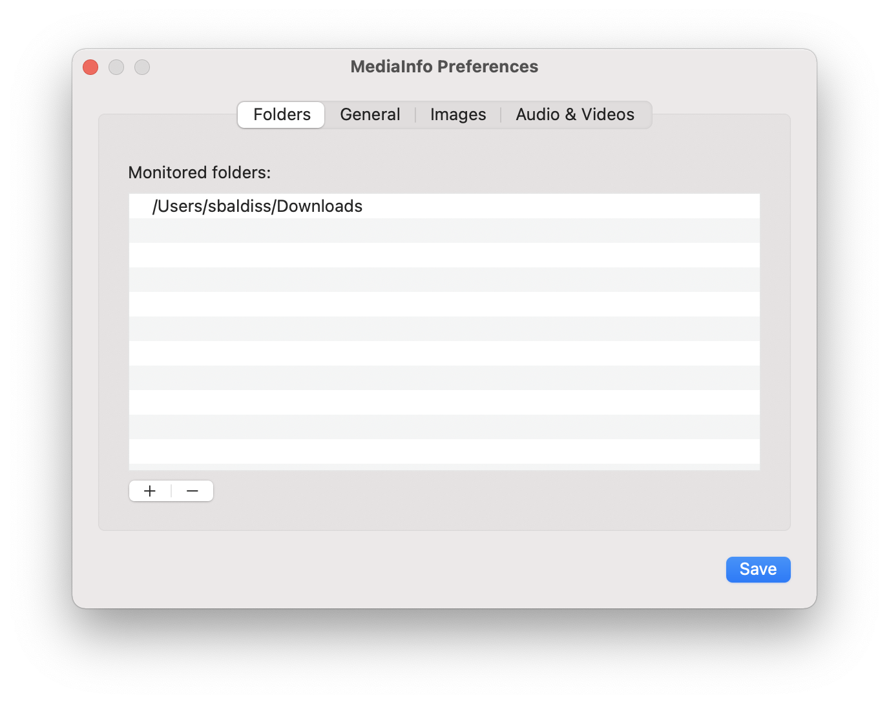
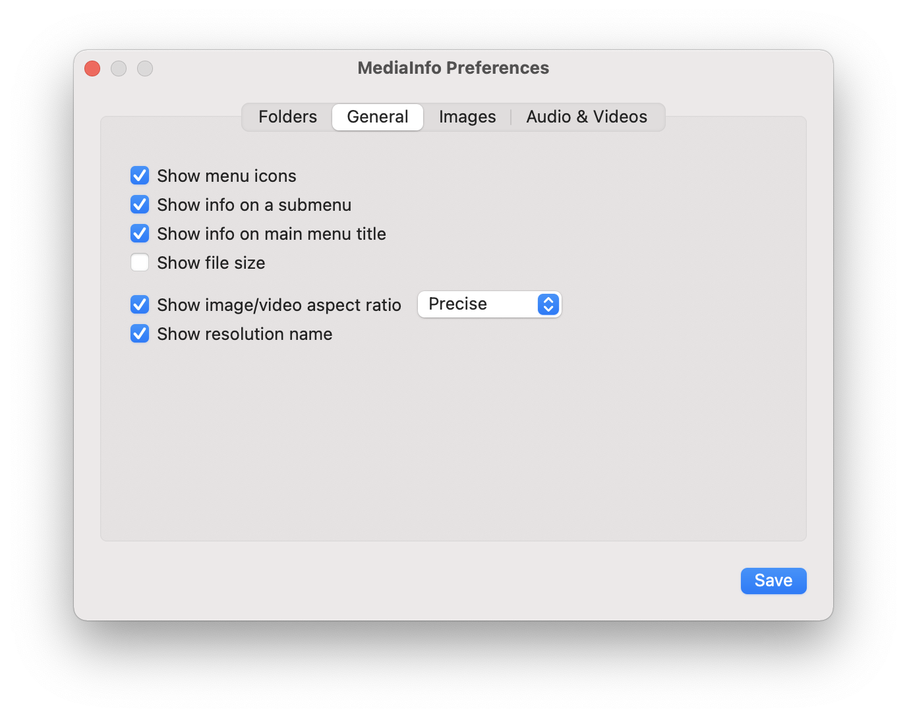
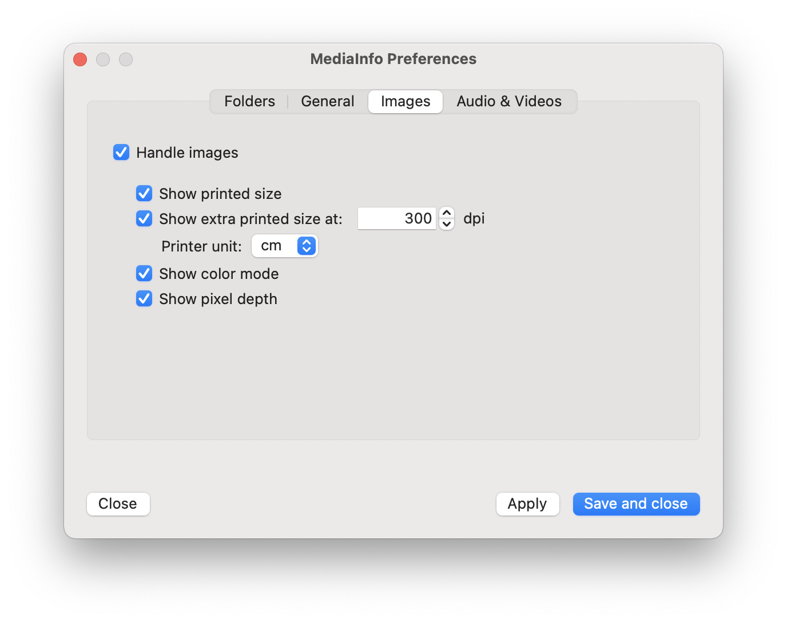
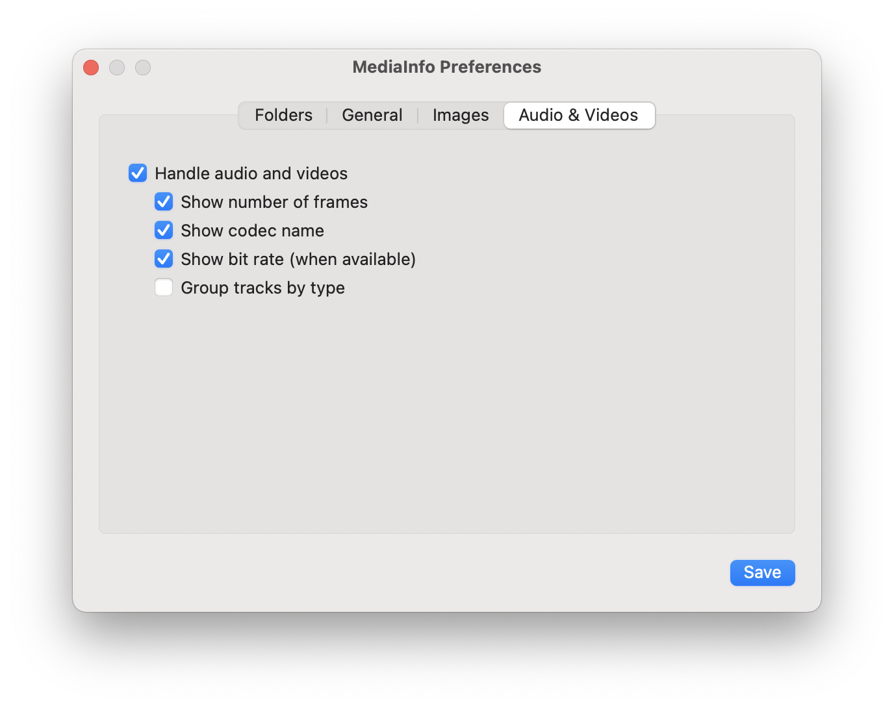

#  MediaInfo - MacOS Finder Sync Extension

This extension display information about multimedia files (images, videos and sounds) in the Finder contextual menu.
Information is shown only for files within the monitored folders (and their subfolders).

> **MediaInfo is distributed in the hope that it will be useful but WITHOUT ANY WARRANTY.**

## Build and Installation

**There is currently no updated pre-compiled release, you need to compile the code yourself.** 

Clone the repository (do not download the source code because break the required git submodule):

```sh
git clone https://github.com/sbarex/MediaInfo.git 
```

then open the Xcode project, change the signing team and build. (First time the build process can be slow due to the compilation of `ffmpeg`.) 

_Apple require that the Application and his Finder Extension must be code signed. I do not have a personal Developer Account so I cannot release a prebuild signed binary._

The required `FFMpeg` and `WebP` libraries are linked inside the extension, so no others external dependency are required.

Move the build app on your Applications folder and launch it to set the monitored folders and the other settings. Then you need to enable the associated Finder Sync Extension on the System Preferences / Extensions.


Now right click (or `control` click) on an image or video within a monitored folder to see the contextual menu with the media information.

Example of a contextual menu for an image:


Example of a contextual menu for a video:



## Settings

With the Application you can customize the monitored folders and the properties to be shown inside the contextual menu.



The _General_ tab allow to set some common options.




### Images



Available information:
- size (in pixel)
- aspect ratio
- resolution (dpi)
- resolution name (as _VGA_, _FullHD_, …)
- color mode (_RGB_, _CMYK_, _GRAYSCALE_, …)
- number of bit
- animation
- printed size (you can also set custom dpi resolution)


Supported image formats:
- images handled by the MacOS via CoreGraphics
- `.webp` with `libwebp`
- `.svg` files
- images handled by `ffmpeg`
- `.pbm` formats
- `.bpg` format (parsing the file header).


### Video and Audio files



Available information:
- info about single stream (video, audio, subtitle)
- size (in pixel)
- aspect ratio
- resolution name (as _VGA_, _FullHD_, …)
- codec
- bit rate
- duration
- number of frames

Not all properties are always available, depending on the type of file and the library used to decode it.

Supported audio/video format:
- audio and video handled by the MacOS via CoreMedia
- audio and video supported by `ffmpeg` library


## Credits

Developed by [sbarex](https://github.com/sbarex) with :heart:.

This application uses these libraries: 
- [FFMpeg](https://www.ffmpeg.org/)
- [WebP](https://developers.google.com/speed/webp/)

This application was inspired by the Quick Look Generator [qlImageSize](https://github.com/Nyx0uf/qlImageSize).
