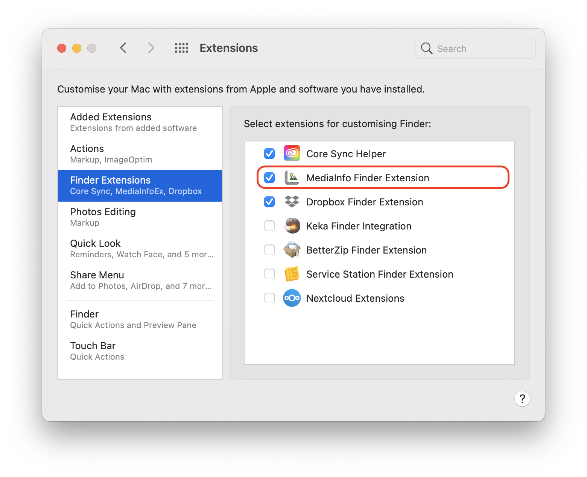
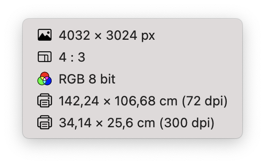
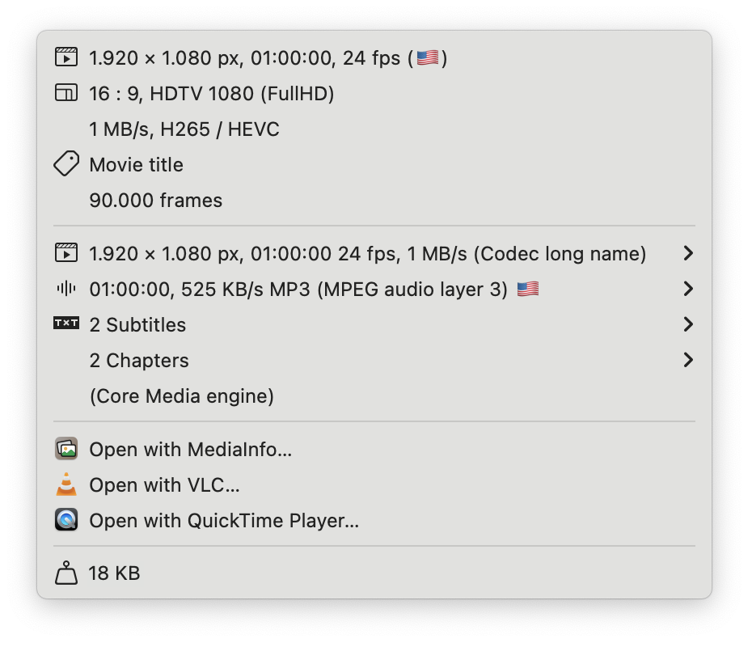
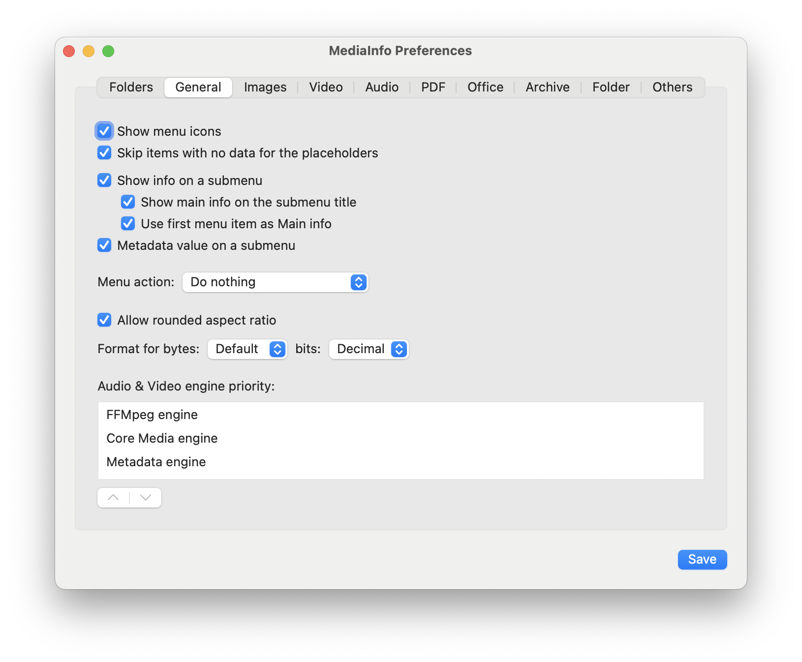
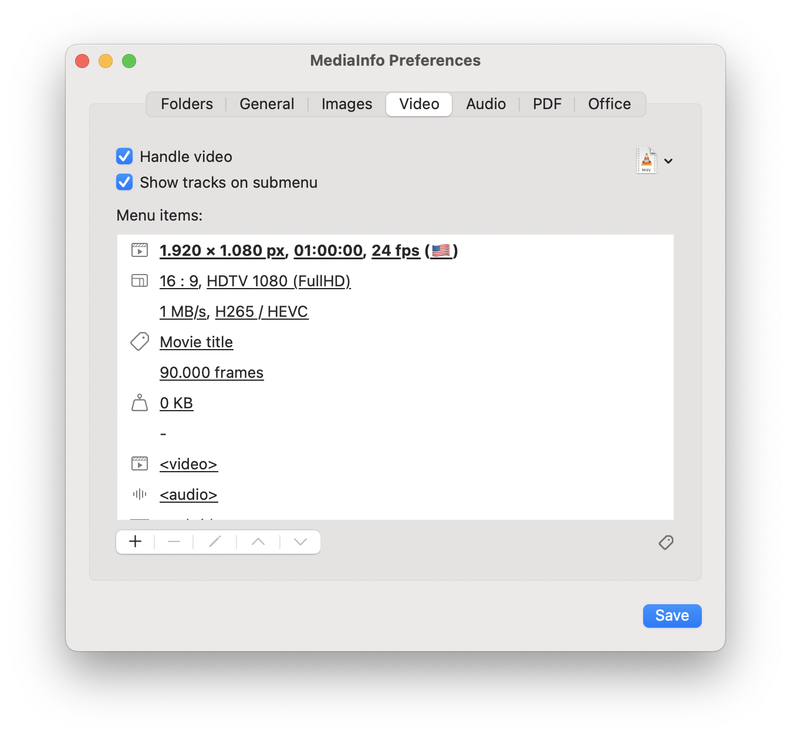
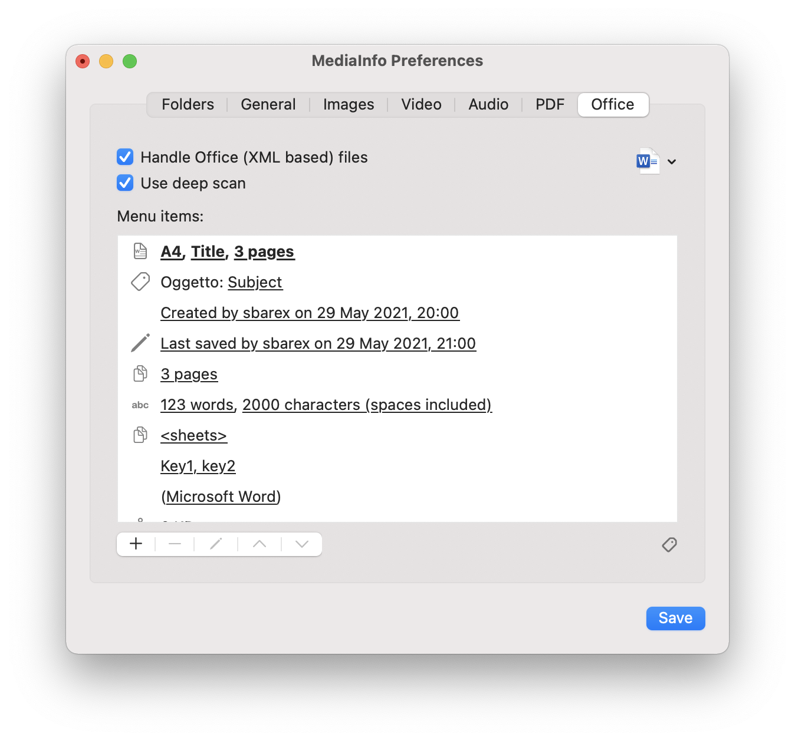
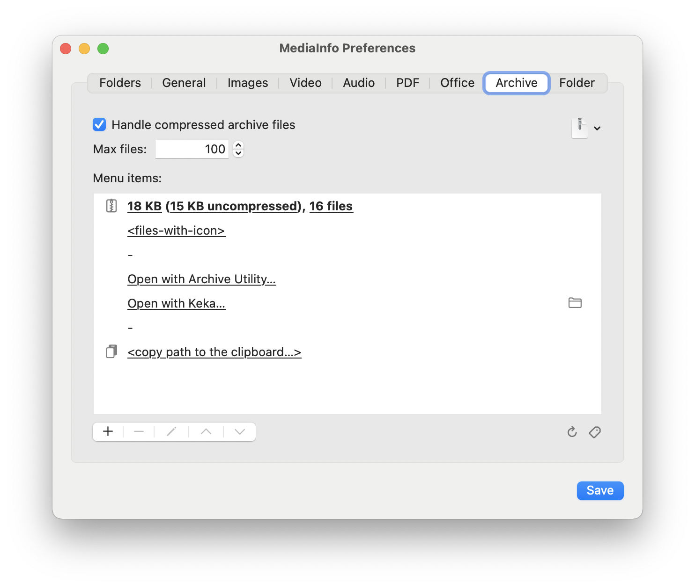
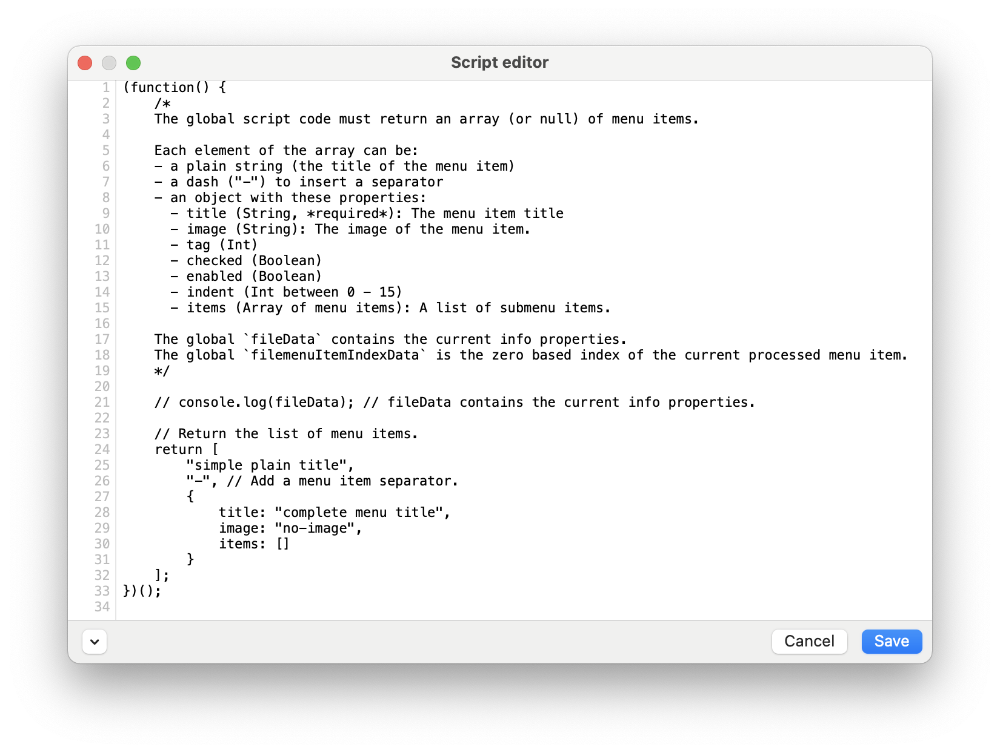
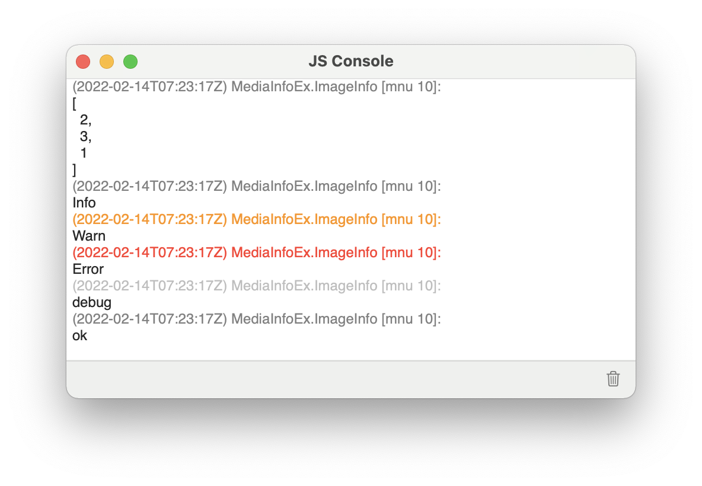

[](https://github.com/sbarex/mediainfo/releases) [](https://github.com/sbarex/mediainfo/releases)

<p align="center">
  
</p>


# MediaInfo - macOS Finder Sync Extension

Extension to display information about multimedia (images, videos and audio), PDF, Office and compressed files in the Finder contextual menu.


> **MediaInfo is distributed in the hope that it will be useful but WITHOUT ANY WARRANTY.**

  - [Installation](#installation)
  - [Settings](#settings)
    - [Monitored folders](#monitored-folder)
    - [General](#general)
    - [Customize the menu items](#customize-the-menu-items)
    - [Images](#images)
    - [Video files](#video-files)
    - [Audio files](#audio-files)
    - [PDF documents](#pdf-documents)
    - [Office files](#office-files)
    - [Compressed archive files](#compressed-archive-files)
    - [Scripting support](#scripting-support)
      - [Inline scripts](#inline-scripts)
      - [Global scripts](#global-scripts)
      - [Exposed data](#exposed-data)
  - [Known bugs and limitations](#known-bugs-and-limitations)
  - [Build from source](#build-from-source)
    - [Dependencies](#dependencies)
    - [Application processes](#application-processes)
  - [Credits](#credits)

## Installation

Head over to the [releases](https://github.com/sbarex/MediaInfo/releases) page to view the latest version. 

Move the downloaded app on your Applications folder and launch it to set the monitored folders and the other settings. 

Then you need to enable the associated Finder Sync Extension on the System Preferences / Extensions.



Now right click (or `control` click) on a supported file within a monitored folder to see the contextual menu with the information.

| Image menu | Video Menu |
|:---------|:--------- |
|  |  |


**The precompiled application is not notarized or signed.** The application is compiled as universal binary (Intel and Apple Silicon processor).

**When you manually download the precompiled app directly you must strip quarantine flag.**
The first time you can launch the app with right click (or ctrl click) on the app icon and choose the open action.

Alternatively, you can open System Preferences > Security & Privacy > General (tab) then clicking the `Open Anyway` button.

If the system warns that the application is damaged, use the following terminal command:

```
$ xattr -cr "FULL PATH OF THE MediaInfo .app (you can drag the file to get the pull path)"
```

This will resolve the error of an unsigned/damaged application when launching the app.

> **When the monitored folders are changed or when the Finder Sync extension is restarted, the System may display a confirmation warning to allow read access to the files of the monitored folders. _Access must be granted for the Finder extension to work._**


## Settings

### Monitored folders

With the Application you can customize the monitored folders and the properties to be shown inside the contextual menu.


You can also enable the support for auto monitor external disk.

> **Information is shown only for files within the monitored folders (and their subfolders).**


### General

The _General_ tab allow to set some common options.




|**Option**|**Description**|
|:-----------|:-----------------|
|Show menu icons|Show icons inside the contextual menu. You can customize the icon for each menu item. Some icons (image, video, pdf, page, ratio, media box, bleed box, art box, text document) respect the orientation (portrait or landscape) of the source. The _color_ icon respects the color space (RGB, CMYK, gray scale, B/W, Lab).|
|Skip items with no data for the placeholders|Do not insert menu item with all empty placeholders.|
|Show info on a submenu|If enabled, on the contextual menu is added a submenu with the info items, otherwise all items are put on the main contextual menu.|
|Show main info on the submenu title|If enabled, a submenu with file information is added to the context menu, otherwise all items are placed in the main context menu.|
|Use first menu item as Main info|Use the first item as the main title for the submenu.|
|Menu action open the selected file|If checked, each menu item will open the source file with the default application. |
|Allow rounded aspect ratio|For images and videos, allow to round the size for a better ratio. |
|Media engine priority|Allows you to choose the order in which the media engines are used to recognize images, videos and sounds. Not all engines can recognize all file properties. If one engine fails to process a file, the next engine is tried.  |

Media engines:
- _Core Media_: it uses the Apple CoreMedia APIs to parse media files. It is able to recognize many formats and most of their properties.
- _FFMpeg_: it uses the FFMpeg library to analyze multimedia files. It generally supports more files and provides more detailed information. However, it requires more resources. 
- _Metadata_: Use Apple Core Service APIs to extract information from metadata. It requires fewer resources but handle less information.


### Customize the menu items

For each managed format it is possible to customize the list of menu items. For each item you can combine plain text with the placeholder which will be filled with its file property.


When composing the menu label, any worthless placeholders are left blank. Multiple spaces or punctuation marks (comma and semicolon) or empty parentheses are automatically eliminated, for this reason it is suggested to separate placeholders whose value may not always be available with spaces, commas or semicolons.

You can also specify an explanatory icon for each item. Some icons (_image_, _video_, _pdf_, _page_, _ratio_, _media box_, _bleed box_, _art box_) respect the orientation (portrait or landscape) of the source. The _color_ icon respects the color space (RGB, CMYK, gray scale, B/W, LAB).

Use a single dash (`-`) to create a menu separator. Please note that for a macOS limitation the separator item will not be shown with the usual dividing line but with an empty menu item.  

If you need more control over the information displayed by the menu items you can also use custom scripts (see the [Scripting support](#scripting-support) chapter).


### Images


Available information:
|**placeholder**|**description**|**example**|
|:----|:----|:----|
|size|Size of the image.|_1920 × 1080 px_|
|width|Width of the image.|_1920 px_|
|height|Height of the image.|_1080 px_|
|aspect ratio|Aspect ratio.|_16 : 9_|
|resolution name|Name of the resolution.|_VGA_, _FullHD_, …|
|color space|Color space.|_RGB_, _CMYK_, _GRAYSCALE_, …|
|depth|Number of bits per pixel.|_24 bit_|
|color space & depth|Color space and depth.|_RGB 8 bit_|
|animation|State of the animation.|_animated_ or _static_|
|is animated|Show if the image is animated.|_animated_ or empty|
|with/without alpha channel.|Show if the image has an alpha channel|_transparent_ or _opaque_|
|with alpha channel.|Show if the image has an alpha channel|_with alpha channel_ or empty|
|dpi|Printer resolution.|_150 dpi_|
|printed size|Printer size. You can choose a custom dpi resolution and different unit (cm, mm, inch).|_21 × 29.7 cm (300 dpi)_|
|paper format|Paper format for the printed size.|_A4_, _Letter_, …|
|file size|File size.|_5 Mb_|
|file name|Name of the file.|_image.jpg_|
|file extension|Extension of the file.|_jpg_|
|metadata|Show the metadata in a submenu.||

Supported image formats:
- images handled by the macOS via CoreGraphics
- `.webp` with `libwebp`
- `.svg` files
- images handled by `FFMpeg`
- `.pbm` formats
- `.bpg` format (parsing the file header).

Extracting metadata is a wasteful operation that can slow down the contextual menu display. For this they are only processed if metadata or script tokens are used. 
If the script code does not require access to the metadata, it is possible to avoid their extraction by entering this comment at the beginning of the code: `/* no-metadata */` 

### Video files



Available information:
|**placeholder**|**description**|**example**| |
|:----|:----|:----|:----:|
|size|Size of the image.|_1920 × 1080 px_||
|width|Width of the image.|_1920 px_||
|height|Width of the image.|_1080 px_||
|aspect ratio|Aspect ratio.|_16 : 9_||
|resolution name|Name of the resolution.|_VGA_, _FullHD_, …||
|duration|Duration.|_01:15:23_, …||
|seconds|Duration in seconds.|_60 s_||
|bit rate|Bit rate.|_1 Mb/s_||
|start time|Start time.|_start at 00:00:00_, …||
|start time (seconds)|Start time in seconds.|_start at second 0_||
|language code|Language country code.|_EN_||
|language flag|Language country flag.|_:it:_||
|codec|Codec name (full name if available, otherwise short name).|_HEVC H.265_||
|codec short name|Codec short name.|_hevc_||
|codec long name|Codec long name.|_HEVC H.265_||
|chapters|Number of chapters.|_2 chapters_ If this placeholder is the only in the menu item will be added a submenu with the list of the chapters.|\*\*|
|video tracks|Number of video tracks.|_2 video tracks_||
|audio tracks|Number of audio tracks.|_1 audio tracks_||
|subtitles|Number of subtitles.|_3 subtitles_||
|languages|Number of languages.|_2 languages_ Show the number of available languages on video and audio tracks.||
|frames|Number of frames.|_1.500 frames_||
|frame rates|Frame rates.|_24 fps_||
|profile|Profile.|_Main_|\*|
|title|Title.|||
|encoder|Encoder.|_libffmpeg_||
|field order|Field order.|_top first_|\*|
|pixel format|Pixel format.|_yuv420p_|\*|
|color space|Color space.|_gbr_|\*|
|file size|File size.|_5 Mb_||
|file name|Name of the file.|_image.jpg_||
|file extension|Extension of the file.|_jpg_||

Not all properties are always available, depending on the type of file and the engine used to decode it.

\* _Available only with FFMpeg engine._
\*\* _Not Available with Metadata engine._

It also shows the data of all the video, audio and subtitle tracks present. This information can be viewed within submenus or in the main menu. The information shown for each track is the same as used for video and audio files. 

Supported video format:
- video handled by the macOS via CoreMedia
- video supported by `FFMpeg` library.


### Audio files


Available information:
|**placeholder**|**description**|**example**|
|:----|:----|:----|
|duration|Duration.|_01:15:23_, …|
|seconds|Duration in seconds.|_60 s_|
|bit rate|Bit rate.|_1 Mb/s_|
|start time|Start time.|_start at 00:00:00_, …|
|start time (seconds)|Start time in seconds.|_start at second 0_|
|language code|Language country code.|_EN_|
|language flag|Language country flag.|_:it:_|
|languages|Number of languages.|_2 languages_ Show the number of available languages on video and audio tracks.|
|codec|Codec name (full name if available, otherwise short name).|_MPEG audio layer 2/3_|
|codec short name|Codec short name.|_mp3_|
|codec long name|Codec long name.|_MPEG audio layer 2/3_|
|channels|Number of channels.|_2 channels_|
|channels|Audio mono, stereo or number of channels.|_Mono_, _Stereo_, _3 channels_, …|
|chapters|Number of chapters.|_2 chapters_ If this placeholder is the only in the menu item will be added a submenu with the list of the chapters.|
|title|Title.||
|encoder|Encoder.|_libffmpeg_|
|file size|File size.|_5 Mb_|
|file name|Name of the file.|_image.jpg_|
|file extension|Extension of the file.|_jpg_|

Not all properties are always available, depending on the type of file and the engine used to decode it.

Supported audio format:
- audio handled by the macOS via CoreMedia
- audio supported by `FFMpeg` library.


### PDF documents


Available information:
|**placeholder**|**description**|**example**|
|:----|:----|:----|
|media box|Media box. You can choose different unit (pt, inch, mm, cm).|_595 × 842 pt_, _A4_, …|
|bleed box|Bleed box. You can choose different unit (pt, inch, mm, cm, paper size).|_595 × 842 pt_, _A4_, …|
|crop box|Crop box. You can choose different unit (pt, inch, mm, cm, paper size).|_595 × 842 pt_, _A4_, …|
|art box|Art box. You can choose different unit (pt, inch, mm, cm, paper size).|_595 × 842 pt_, _A4_, …|
|paper format|Paper format for the printed size.|_A4_, _Letter_, …|
|pages|Number of pages.|_15 pages_|
|author|Author.|_sbarex_|
|productor|Productor.||
|creator|Creator.||
|creation date|Creation date.||
|modification date|Modification date.||
|keywords|Keywords.||
|object|Object.||
|title|Title.||
|locked|Locked status.|:lock: or empty|
|encrypted|Encrypted status.|:key: or empty|
|allows copy|Allows copy status.|_yes_ or _no_|
|allows print|Allows print status.|_yes_ or _no_|
|security|Security state. Compose the _locked_, _encrypted_, _copy_ and _print_ tokens.|_:lock: no copy_|
|version|PDF version.|_version 1.6_|
|file size|File size.|_5 Mb_|
|file name|Name of the file.|_image.jpg_|
|file extension|Extension of the file.|_jpg_|

Adobe Illustrator `.ai` files are also supported.


### Office files

The following file formats are supported: `.docx`, `.rtfx`, `.pptx`, `.odt`, `.ods`, .`odp` (standard office files based on the `XML` format).



Extracting some metadata requires a deep scan of the main file. This can cause a delay in the display of the context menu of office files. For this reason, the deep scan is enabled only when requested by the chosen tokens or when script tokens are present. If the script code does not require access to the metadata, you can avoid its extraction by  placing this comment at the beginning of the code: `/* no-deep-scan */`

Available information:
|**placeholder**|**description**|**example**|**require deep scan**|
|:----|:----|:----|:-----:|
|page size|Page size. _Only for text document files._ You can choose different unit (inch, cm, mm). Can also show the paper format, like _A4_.|_21 × 29.7 cm_, _A4_, …|_Yes_|
|creator|File creator.|_sbarex_||
|creation date|Creation date.|_3 May 2021 11:23_||
|last author|User who made the last save.|_sbarex_||
|modification date|Last save date.|_3 May 2021 11:23_||
|title||||
|subject||||
|description|File description / comments.|||
|keywords|Keywords of the file, shown as a submenu.|||
|number of pages|Number of pages (document files), sheets (spreadsheets) or slides (presentations). For spreadsheets, if this placeholder is used alone, it also shows a submenu with the list of sheet names. |_4 pages_, _3 spreadsheets_, _24 slides_|_Yes_|
|characters|Number of characters, without spaces. _Only for text document files._|_1821 characters_||
|characters (spaces included)|Number of characters, with spaces included. _Only for text document files._|_2300 characters_||
|words|Number of words. _Only for text document files._|_150 words_||
|sheets|List of the sheet names, show as a submenu. _Only for spreadsheet files._||_Yes_|
|application|Application that generated the file.|_MicrosoftOffice/15.0 MicrosoftWord_||
|file size|File size.|_5 Mb_||
|file name|Name of the file.|_image.jpg_||
|file extension|Extension of the file.|_jpg_||


### Compressed archive files

The compressed archive files are handled by the `libarchive` library. 
The following file formats are supported: `.zip`, `.rar`, `.7z`, `.tar`, `.pax`, .`ar`, `.xar`, `.cab`.




You can limit the processed data with these options:
|**option**|**description**|
|:----|:----|
|Max files|Overall maximum number of files to process from the compressed file.|
|Max depth|Maximum depth number of subfolders.|
|Max files per depth|Maximum number of files processed within a depth level.|

You can set to zero these option to disable the limit.

Available information:
|**placeholder**|**description**|**example**|
|:----|:----|:----|
|number of files|Number of files and directories inside the archive. _Is not influenced by the max files options._|_15 files_|
|files menu|Submenu with the structure of files inside the archive. It is possible to show also the icon of every files. _The items are limited according to the max files and depth options._||
|plain files menu|Submenu with the list of files inside the archive. It is possible to show also the icon of every files. _The items are limited according to the max files and depth options._||
|uncompressed size|Uncompressed size of the archived data. Is not influenced by the max files options.|_8 Mb_|
|file size|Size of the compressed file.|_1 Mb_|
|file name|Name of the file.|_image.jpg_|
|file extension|Extension of the file.|_zip_|


## Scripting support

It is possible to customize the content of the menu items through javascript code. 

The javascript environment is shared with all scripts defined in menu items, thus allowing you to set values in the code to pass from one script to another. The scripts are executed in order of belonging in the menu. 

Since the environment is shared among all the scripts, **remember to be careful not to declare the same global variables in multiple scripts using `let` and `const` statement** (If you need to redeclare a global variable you can use the `var` statement). 

Exceptions thrown during code execution are indicated by an exclamation icon. 

I recommend enclosing the code inside an anonymous function: 

```javascript
(function() {
    let result = '';
    
    // your code here
    
    return result; // <- This will be the menu title.  
})()
```  

In the javascript environment, the `fileData` variable is an object that contains the data representation of the currently processed file. _Please note that any changes made to the `fileData` properties will not affect the content of the standard token used in the other menu items._ 



There are two script tokes: inline and global. 


### Inline scripts

The inline script token allows you to place the result of the script evaluation inside a menu item with any other tokens. 

The result of the script corresponds to the last statement executed in the code.
The last statement must return a string value (or null).

```javascript
(function() {
    const s1 = "Hello World";

    return s1 + " from " + fileData.fileName; // <- This will be the menu title.
})()
```

### Global scripts

The global token script allows you to create multiple menu items at once.

```javascript
(function() {
    let items = new Array();
    items.push({title: "label 1", image: null});
    items.push({title: "label 2", image: "pencil"});
    items.push("-"); // This is a separator
    items.push({
        title: "submenu",
        items: [
            {title: "first"},
            "second",
        ]
    });

    return items;
})()
```

The last statement executed must return an array of items representing the menu items to be added. 

Each item in the returned array can be:
- A string that will be used as a title.
- An object with these properties:
  - `title` (string, required) The title of the menu item. 
  - `image` (string, optional) The name of the image for the menu item.
  - `checked` (bool, optional) Set to `true` to add the checkmark to the menu item.
  - `indent` (int, optional) Indentation level.
  - `tag` (int, optional)
  - `items` (Array, optional) An array of the subitems. 

The `image` property can be:

|value|image|
|:----|:----|
|`null` or `"no-image"`|No image, but reserve a space if is set the visibility of icon in the menu items.|
|`no-space`|No image, and do not reserve a space.|
|`"image"`, `"image_h"`||
|`"image_v"`||
|`"aspectratio"`, `"aspectratio_h"`||
|`"aspectratio_v"`||
|`"color"`||
|`"color_rgb"`||
|`"color_cmyk"`||
|`"color_gray"`||
|`"color_lab"`||
|`"color_bw"`||
|`"print"`, `"printer"`||
|`"video"`, `"video_h"`||
|`"video_v"`||
|`"audio"`||
|`"speaker"`, `"speaker_mono"`||
|`"speaker_stereo"`||
|`"txt"`||
|`"abc"`||
|`"page"`, `"page_h"`||
|`"page_v"`||
|`"pages"`||
|`"office"` or `"doc"` or `"docx"`, `"word"`||
|`"doc_h"`||
|`"xls"`, `"xlsx"`, `"excel"`||
|`"ppt"`, `"pptx"`, `"powerpoint"`||
|`"3D"`||
|`"3d_color"`||
|`"3d_occlusion"`||
|`"3d_lines"`||
|`"3d_normal"`||
|`"3d_points"`||
|`"3d_quads"`||
|`"3d_tangent"`||
|`"3d_triangle_stripe"`||
|`"3d_triangle"`||
|`"3d_uv"`||
|`"3d_variable"`||
|`"pdf"`, `"pdf"`||
|`"pdf_v"`||
|`"artbox"`||
|`"artbox_v"`||
|`"bleed"`||
|`"bleed_v"`||
|`"crop"`||
|`"zip"`||
|`"size"`||
|`"person"`||
|`"shield"`||
|`"tag"`||
|`"pencil"`||

### Exposed data

The global variable `fileData` contain the properties of the processed file.

The global variable `menuItemIndex` is set to the index (zero based) of the current processed menu item template.

_You cannot change the properties of `fileData` to alter the data displayed by standard tokens._ 

In the javascript environment, the `console.log()` function is available to allow a rudimentary tracing function in the Javascript Console Window (available from the Window menu). Also, there are available `console.error()`, `console.warn()` `console.info()`,  `console.debug()`, `console.assert()`.




#### Common properties

|property|type|description|example|
|:-------|:---|:----|:------|
|`fileData`.`fileUrl`|string|The url of the processed file.|_"file:///Users/Default/Documents/file.jpg"_|
|`fileData`.`fileSize`|int|File size (in bytes) of file.|_31470_|
|`fileData`.`fileName`|string|Basename.|_"file.jpg"_|
|`fileData`.`fileExtension`|string|File extension.|_"jpg"_|
|`fileData`.`filePath`|string|Full path.|_"/Users/Default/Documents/file.jpg"_|


#### Properties for the images

|property|type|description|example|
|:-------|:---|:----|:------|
|`fileData`.`depth`|int||_8_|
|`fileData`.`dpi`|int||_300_|
|`fileData`.`hasAlpha`|bool||_false_|
|`fileData`.`isAnimated`|bool||_false_|
|`fileData`.`isFloating`|bool||_false_|
|`fileData`.`isIndexed`|bool||_false_|
|`fileData`.`colorMode`|string||_"RGB"_|
|`fileData`.`profileName`|string||_"Color LCD"_|
|`fileData`.`metadata`|Object|All extracted metadata.||
|`fileData`.`metadata`.`Exif`|Array|Exif metadata.||
|`fileData`.`metadata`.`ExifAux`|Array|Auxiliary Exif metadata.||
|`fileData`.`metadata`.`TIFF`|Array|TIFF metadata.||
|`fileData`.`metadata`.`JFIF`|Array|JFIF metadata.||
|`fileData`.`metadata`.`GIF`|Array|GIF metadata.||
|`fileData`.`metadata`.`HEICS`|Array|HEICS metadata.||
|`fileData`.`metadata`.`PNG`|Array|PNG metadata.||
|`fileData`.`metadata`.`IPTC`|Array|IPTC metadata.||
|`fileData`.`metadata`.`GPS`|Array|GPS metadata.||
|`fileData`.`metadata`.`RAW`|Array|RAW metadata.||
|`fileData`.`metadata`.`Canon`|Array|Canon metadata.||
|`fileData`.`metadata`.`Nicon`|Array|Nicon metadata.||
|`fileData`.`metadata`.`Minolta`|Array|Minolta metadata.||
|`fileData`.`metadata`.`Fuji`|Array|Fuji metadata.||
|`fileData`.`metadata`.`Olympus`|Array|Olympus metadata.||
|`fileData`.`metadata`.`Pentax`|Array|Pentax metadata.||
|`fileData`.`metadata`.`8BIM`|Array|8BIM metadata.||
|`fileData`.`metadata`.`DNG`|Array|DNG metadata.||
|`fileData`.`metadata`.`OpenEXR`|Array|OpenEXR metadata.||
|`fileData`.`metadata`.`Apple`|Array|Apple metadata.||
|`fileData`.`metadata`.`File`|Array|File metadata.||
|`fileData`.`metadata`.`WebP`|Array|WebP metadata.||
|`fileData`.`metadata`.`TGA`|Array|TGA metadata.||
|`fileData`.`metadataRaw`|Object|An object with the same properties of `fileData`.`metadata` with a JSON representation of the original metadata array. _Only dictionaries that can be converted to JSON are exported._ ||

If no metadata token are used and all the script code begin with the comment `/* no-metadata */` the metadata will not be extracted.
Depending on the image type, not all metadata properties will be populated. 

Every metadata group is an array of objects. Each object has three string properties: `code`, `value` and `label`. For a list of metadata codes see ImageIO - `CGImageProperties.h` on the Apple documentation.


#### Properties for video files

|property|type|description|example|
|:-------|:---|:----|:------|
|`fileData`.`audioTracks`|Array|||
|`fileData`.`bitRate`|int||_1048576_|
|`fileData`.`chapters`|Array|||
|`fileData`.`codecLongName`|string\|null||_"H265 / HEVC"_|
|`fileData`.`codecShortName`|string||_"hevc"_|
|`fileData`.`colorSpace`|int\|null||_7_|
|`fileData`.`colorSpaceLabel`|strin\|null||_"smpte240m"_|
|`fileData`.`duration`|int|Number of seconds.|_3600_|
|`fileData`.`encoder`|string\|null|||
|`fileData`.`engine`|string|Engine used to decode the file.|_"Core Media engine"_|
|`fileData`.`fieldOrder`|int\|null|`0`: topFirst. `1`: bottomFirst. `2`: topFirstSwapped. `3`: bottomFirstSwapped. `4`: unknown. `5`: progressive.|_0_|
|`fileData`.`fieldOrderLabel`|string\|null||_"top first"_|
|`fileData`.`fps`|int||_24_|
|`fileData`.`frames`|int|||
|`fileData`.`isLossless`|bool\|null|||
|`fileData`.`lang`|string\|null||_EN_|
|`fileData`.`langFlag`|string\|null||_":it:"_|
|`fileData`.`pixelFormat`|int\|null||_32_|
|`fileData`.`pixelFormatLabel`|int\|null||_32_|
|`fileData`.`profile`|string\|null||_"Main"_|
|`fileData`.`startTime`|int||_-1_|
|`fileData`.`subtitles`|Array|||
|`fileData`.`title`|string\|null||_"Movie title"_|
|`fileData`.`videoTracks`|Array|||

Every item in the `fileData`.`audioTracks` is an object with these properties:

|property|type|description|example|
|:---|:---|:----|:------|
|`codecLongName`|string\|null||_"MP3 (MPEG audio layer 3)"_|
|`codecShortName`|string||_"mp3"_|
|`bitRate`|int||_524800_|
|`channels`|int||_2_|
|`duration`|int|Number of seconds.|_3600_|
|`encoder`|string\|null|||
|`isLossless`|bool\|null||_false_|
|`lang`|string\|null||_EN_|
|`langFlag`|string\|null||_":it:"_|
|`startTime`|int||_0_|
|`title`|string|||

Every item in the `fileData`.`chapters` is an object with these properties:

|property|type|description|example|
|:-------|:---|:----|:------|
|`title`|string\|null|||
|`start`|int||_201_|
|`end`|int||_600_|

Every item in the `fileData`.`subtitles` is an object with these properties:

|property|type|description|example|
|:-------|:---|:----|:------|
|`title`|string\|null|||
|`lang`|string\|null||_"EN"_|
|`langFlag`|string\|null||_":it:"_|


#### Properties for audio files

|property|type|description|example|
|:-------|:---|:----|:------|
|`fileData`.`bitRate`|int||_156027_|
|`fileData`.`channels`|int||_2_|
|`fileData`.`chapters`|Array|See the chapters of the video files.||
|`fileData`.`codecLongName`|string\|null|||
|`fileData`.`codecShortName`|string||_"mp3"_|
|`fileData`.`duration`|double||_2.35_|
|`fileData`.`encoder`|string\|null|||
|`fileData`.`engine`|string||_"Core Media engine"_|
|`fileData`.`isLossless`|bool\|null||_false_|
|`fileData`.`lang`|string\|null||_"EN"_|
|`fileData`.`langFlag`|string\|null||_":it:"_|
|`fileData`.`startTime`|int||_-1_|
|`fileData`.`title`|string\|null|||


#### Properties for PDF files

|property|type|description|example|
|:-------|:---|:----|:------|
|`fileData`.`allowsCopying`|bool||_true_|
|`fileData`.`allowsPrinting`|bool||_true_|
|`fileData`.`artBox`|Rect Array|An array of two array. The first contains the x and y coordinate of the origin, ant the second the width and height.|_[[0, 0], [612, 792]_|
|`fileData`.`author`|string||_"sbarex"_|
|`fileData`.`bleedBox`|Rect Array|See `fileData`.`artBox`.||
|`fileData`.`creationDate`|double\|null|Time interval since 1970.|_642924149_|
|`fileData`.`creator`\|null|string||_"Acrobat Pro DC 21.1.20155"_|
|`fileData`.`cropBox`|Rect Array|See `fileData`.`artBox`.||
|`fileData`.`isEncrypted`|bool||_false_|
|`fileData`.`isLocked`|||_false_|
|`fileData`.`keywords`|Array|Array of string.|_["key1", "key2"]_|
|`fileData`.`modificationDate`|double\|null|Time interval since 1970.|_642924257_|
|`fileData`.`pagesCount`|int||_1_|
|`fileData`.`producer`|string\|null||_"Acrobat Pro DC 21.1.20155"_|
|`fileData`.`subject`|string\|null||_"PDF test file"_|
|`fileData`.`title`|string\|null||_"Title of the PDF"_|
|`fileData`.`trimBox`|Rect Array|See `fileData`.`artBox`.||
|`fileData`.`version`|string||_"1.6"_|


#### Properties for Office files

|property|type|description|example|
|:-------|:---|:----|:------|
|`fileData`.`application`|string||_"Microsoft Word"_|
|`fileData`.`charactersCount`|int||_1765_|
|`fileData`.`charactersWithSpacesCount`|int||_2000_|
|`fileData`.`creationDate`|double\|null||_666192249.77143204_|
|`fileData`.`creator`|string||_sbarex_|
|`fileData`.`description`|string|||
|`fileData`.`height`|double|Inch.|_11.69291338582677_|
|`fileData`.`keywords`|Array|Array of string.|_["key1", "key2"]_|
|`fileData`.`modificationDate`|double\|null||_666195849.771433_|
|`fileData`.`modified`|string||_"sbarex"_|
|`fileData`.`pagesCount`|int||_3_|
|`fileData`.`subject`|string|||
|`fileData`.`title`|string|||
|`fileData`.`width`|double|Inch.|_8.2677165354330704_|
|`fileData`.`wordsCount`|int||_123_|


#### Properties for compressed archive files

|property|type|description|example|
|:-------|:---|:----|:------|
|`fileData`.files|Array|Array of files. The list is limited according to the user settings.||
|`fileData`.unlimitedFileCount|int|Total files inside the archive.|_44_|
|`fileData`.unlimitedFileSize|int|Uncompressed size of all files, in bytes.|_1153761_|

Every item in the `fileData`.`files` array has these properties:

|property|type|description|example|
|:-------|:---|:----|:------|
|accessDate|int|Unix timestamp. Zero if the info is not available.||
|acl|string\|null||_"user::rwx\ngroup::rwx\nother::r-x"_|
|creationDate|int|Unix timestamp. Zero if the info is not available.||
|files|Array|If the item is a directory, this property has the file list.||
|flags|int|||
|format|string||"ZIP 1.0 (uncompressed)"|
|gid|int|Group user id.|_0_|
|gidName|string\|null|||
|isAbsolute|bool|Check if the file has an absolute path.|_false_|
|isApp|bool|Check if the file is a macOS Application bundle.|_false_|
|isBundle|bool|Check if the file is a macOS generic bundle.|_false_|
|isEncrypted|bool||_false_|
|isHidden|bool|Check if the file is hidden (file name start with a dot).|_false_|
|link|string\|null|||
|mode|string||_"drwxrwxr-x "_|
|modificationDate|int|Unix timestamp. Zero if the info is not available.|_1552232126_|
|originalPath|string|Full path as saved in the archive.|_"folder/file.ext"_|
|size|int|File size, in bytes. Zero for directories.||
|type|int||_5_|
|typeLabel|string||_"directory"_|
|uid|int|User id.|_0_|
|uidName|string\|null|||


## Known bugs and limitations

- A managed folder placed in the Finder sidebar uses a wrong icon. 
This only happens for directly managed folders, not for subfolders. This is a common issue for many Finder Extension due to a macOS API limitation. **A temporary workaround is to manage the parent folder of the one located in the sidebar.**

- Menu item separators are not rendered as usual.
This is a limitation of the Apple API. The separators are rendered as a disabled empty menu items.

- The Apple API allow to set only few option for each menu items: `title`, `tag`, `image` (automatically resized to 16x16 px), `indentationLevel`, `enabled`, `state`, `action` (the target is always the `FIFinderSync` object). When the image is passed from the code to the System it will be reprocessed ad lose the template attribute. This prevent the B/W image to change the color from black to white when the menu item is selected.


## Build from source

Clone the repository (do not download the source code because break the required git submodule):

```sh
git clone https://github.com/sbarex/MediaInfo.git 
```

Then open the Xcode project, change the signing team and build. First time the build process can be slow due to the compilation of the dependencies libraries.

The required libraries are linked inside the extension and compiled within Xcode, so no others external dependencies are required.


### Dependencies

This app uses these libraries:
- [`FFMpeg`](https://www.ffmpeg.org/)
- [`WebP`](https://developers.google.com/speed/webp/)
    - [`libpng`](http://www.libpng.org/)
    - [`jpeg-turbo`](https://libjpeg-turbo.org/) (require CMake to build)
- [`libarchive`](https://www.libarchive.org/)
    - [`liblz4`](https://lz4.github.io/lz4/)
    - [`libb2`](https://github.com/BLAKE2/libb2)
    - [`zstd`](https://github.com/facebook/zstd)
- [`LineNumberTextView`](https://github.com/raphaelhanneken/line-number-text-view)
    
### Application processes

The application uses two XPC processes:
- _MediaInfo Settings XPC_: used by the main application to store the settings. This bypass the _AppGroup_ functionality that require a signed app to works.
- _MediaInfo Helper XPC_: used by the Finder Extension to read the settings an analyze the selected file. The XPC process can access to files within mounted disks (external or network disks) that would not be accessible by the MediaInfo Finder Extension.


## Credits

Developed by [sbarex](https://github.com/sbarex) with :heart:.
